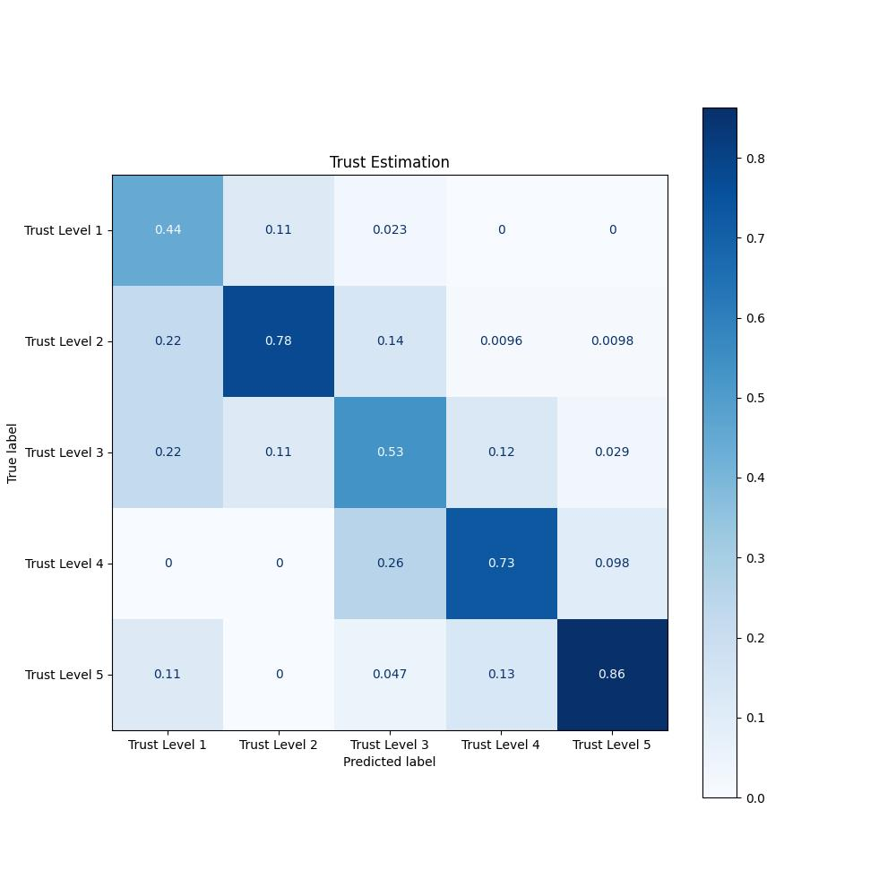
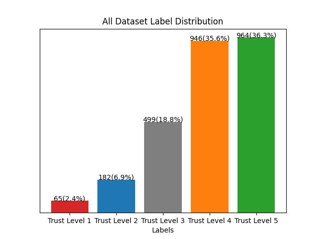

# FACT-AV: Introducing the Framework for Calibration of Trust in Automated Vehicles

This is the current source-code for the multilayer perceptron experiment.

We trained a small multilayer perceptron on our collected dataset, which we split into a train (N=2124), validation (N=265), and test (N=267) dataset. We trained our classifier for $26600$ steps, with a batch size of 16, and using the AdamW~\cite{loshchilov2017decoupled} optimizer with a constant learning rate of 0.0001, $\beta_1=0.9$, $\beta_2=0.999$, $eps=1e-08$ and weight decay of 0.1. In order to prevent overfitting, we use a dropout rate of 0.5 in each layer. Finally, after the training converges, we evaluate our classifier using our test dataset. The performance of the model is measured using accuracy (74.2\%) and the F1 score (74.2\%). These results indicate that our model is able to capture the correlation between input parameters and the ground truth and, thus, can estimate the level of trust based on ten given variables mIoU, scenario, introduction, gender, age, education, jobs, driver's license, driving frequency, and driven distance. For the classification task, we used $5$ classes for trust estimation, ranging from level 1 to level 5. The ten input parameters are converted to one hot encoded vector for categorical variables and scalar values. The model architecture consists of $4$ linear layers with sizes $[128, 512, 1024, 1024]$ and an additional last layer that acts as a classification layer outputting a vector of size $5$.

All necessary code and the final model is available. 
