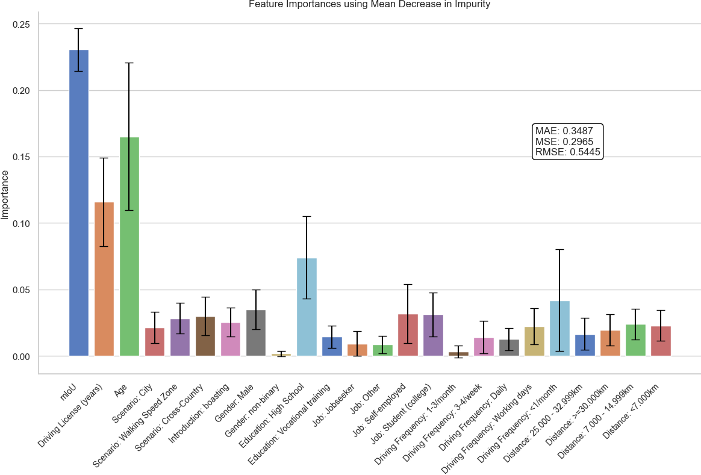
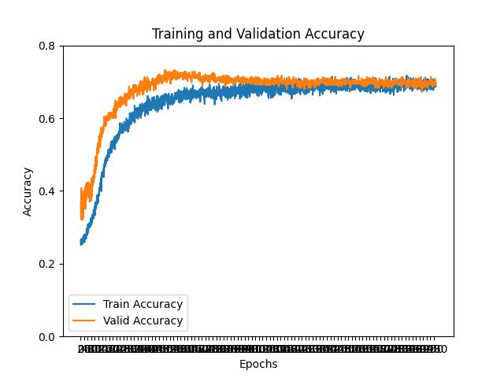

# Understanding the Effects of Different Reliabilities of Automated Vehicle Functionality on the Calibration of Trust

This repository contains the full analysis pipeline for studying how the mean Intersection over Union (mIoU) of AV perception outputs relates to human trust calibration. The code covers feature-importance analysis with multiple ML models, symbolic regression via PySR, and a multilayer perceptron (MLP) trust classifier trained on reliability, demographic, and contextual variables.

---

## Table of Contents

1. [Research Background](#research-background)
2. [System Requirements](#system-requirements)
3. [Installation](#installation)
4. [Project Structure](#project-structure)
5. [Data Schema](#data-schema)
6. [Running the Analyses](#running-the-analyses)
   - [Feature Importance (ML-approaches.py)](#1-feature-importance-ml-approachespy)
   - [Symbolic Regression — Basic (main_pysr_trust_calibration.py)](#2-symbolic-regression--basic)
   - [Symbolic Regression — Group-based (main_group_pysr_trust_calibration.py)](#3-symbolic-regression--group-based)
   - [Symbolic Regression — More Predictors (main_group_pysr_trust_calibration_more_predictors.py)](#4-symbolic-regression--more-predictors)
   - [Symbolic Regression — Personalized (main_personalized_pysr_trust_calibration.py)](#5-symbolic-regression--personalized)
   - [MLP Classifier — Training](#6-mlp-classifier--training)
   - [MLP Classifier — Evaluation](#7-mlp-classifier--evaluation)
   - [Running All PySR Pipelines at Once (Windows)](#8-running-all-pysr-pipelines-at-once-windows)
   - [Publication Figures](#9-publication-figures)
   - [Advanced Explainability](#10-advanced-explainability)
   - [Mixed-Effects Baseline](#11-mixed-effects-baseline)
7. [Configuration Reference](#configuration-reference)
8. [Output Artifacts](#output-artifacts)
9. [Running Tests](#running-tests)
10. [Troubleshooting](#troubleshooting)
11. [Results Summary](#results-summary)
12. [Tools and Libraries](#tools-and-libraries)
13. [Citation](#citation)

---

## Research Background

Autonomous vehicles (AVs) rely on perception systems to understand their environment. The **mIoU** (mean Intersection over Union) is a standard metric quantifying how accurately a perception model delineates objects — higher mIoU means more reliable perception. This project investigates:

- How much does mIoU drive human trust in AV systems?
- Do presentation style (boasting vs. ambiguous introduction) and driving scenario (urban, rural, pedestrian zone) moderate this relationship?
- Can symbolic equations describe the mIoU–trust relationship at the individual and group level?
- How accurately can a deep model classify human trust levels from reliability and demographic features?

The study uses a within-subjects experiment. Participants watched videos with varying mIoU values paired with either a **boasting** (overconfident) or **ambiguous** system introduction across four scenarios.

---

## System Requirements

| Requirement | Minimum |
|---|---|
| Python | 3.11+ |
| RAM | 8 GB (16 GB recommended for TabPFN) |
| Disk | ~2 GB for all dependencies |
| GPU | Optional; CUDA-enabled GPU speeds up MLP training and some models |
| OS | Windows, macOS, or Linux |

> **PySR dependency on Julia:** PySR uses Julia under the hood for symbolic regression. On the first run, PySR will automatically download and install a bundled Julia runtime — no manual Julia installation is needed.

---

## Installation

```bash
# 1. Create and activate a virtual environment
python -m venv .venv
# Windows:
.venv\Scripts\activate
# macOS/Linux:
source .venv/bin/activate

# 2. Upgrade pip and install all dependencies
pip install --upgrade pip
pip install --upgrade -r requirements.txt

# 3. Install development dependencies (needed to run tests)
pip install --upgrade -r requirements-dev.txt
```

> The first `import pysr` call will trigger Julia installation and precompilation. Expect a few minutes on the first run.

---

## Project Structure

```
.
├── data/                          # Preprocessed Excel datasets
│   ├── all_combined_prepared.xlsx
│   ├── all_combined_prepared_removed_REI.xlsx
│   ├── all_combined_prepared_with_demographics.xlsx
│   └── all_combined_prepared_with_demographics_with_baseline.xlsx
│
├── MLP/                           # Deep learning pipeline
│   ├── __init__.py
│   ├── dataset.py                 # PyTorch Dataset, label encoding, feature encoding
│   ├── network.py                 # 4-layer MLP architecture
│   ├── train.py                   # Training loop with checkpoint management
│   ├── eval.py                    # Checkpoint evaluation and confusion matrix
│   └── epochs/                    # Training curve snapshots (generated)
│
├── results/                       # All generated figures and text outputs
│   ├── ML-Approaches/
│   ├── PySR/
│   │   ├── split_groups/
│   │   ├── split_groups_personalized/
│   │   ├── more_predictors/
│   │   └── personalized_plots/
│   └── MLP/
│
├── tests/                         # Automated test suite
│   ├── test_data_integrity.py
│   ├── test_ml_approaches.py
│   ├── test_mlp_encoding.py
│   ├── test_mlp_label_modes.py
│   ├── test_pysr_helpers.py
│   └── test_repo_assets.py
│
├── ML-approaches.py               # ML baselines and feature-importance workflows
├── main_pysr_trust_calibration.py                          # PySR: per intro/scenario subset
├── main_group_pysr_trust_calibration.py                    # PySR: equal-group splitting
├── main_group_pysr_trust_calibration_more_predictors.py    # PySR: multi-feature model
├── main_personalized_pysr_trust_calibration.py             # PySR: per-participant
├── all_pysr.bat                   # Windows batch script to run all PySR pipelines
├── requirements.txt
└── requirements-dev.txt
```

---

## Data Schema

All datasets are Excel files with `Sheet1`. Columns vary by file:

### Core columns (all files)

| Column | Type | Description |
|---|---|---|
| `ProlificID` | string | Anonymised participant identifier |
| `mIoU` | float [0, 1] | Perception reliability metric for the shown video |
| `trust` | float {1.0, 1.5, …, 5.0} | Aggregated trust rating on a 1–5 scale (half-steps possible) |
| `Trust1`–`Trust5` | float | Individual trust sub-scale items |
| `SCENARIO` | string | Driving scenario: `3Spurig`, `NeueMitte`, `Spielstrasse`, `Ueberland` |
| `INTRODUCTION` | string | System intro style: `ambiguous` or `boasting` |

### Additional columns (demographics files)

| Column | Type | Description |
|---|---|---|
| `Age` | int | Participant age in years |
| `Gender` | string `A1`–`A4` | F / M / non-binary / prefer not to say |
| `Education` | string `A1`–`A5` | Secondary / Middle / High School / College / Vocational |
| `Job` | string `A1`–`A6` | Student (school) / Student (college) / Employee / Self-employed / Jobseeker / Other |
| `License` | string `Y`/`N` | Holds a driving licence |
| `DrivingFrequency` | string `A1`–`A6` | Daily → less than once/month |
| `Distance` | string `A1`–`A5` | Annual kilometres driven (bands) |

### Dataset variants

| File | Notes |
|---|---|
| `all_combined_prepared.xlsx` | Base dataset |
| `all_combined_prepared_removed_REI.xlsx` | REI (Rational–Experiential Inventory) participants removed |
| `all_combined_prepared_with_demographics.xlsx` | Base + demographics |
| `all_combined_prepared_with_demographics_with_baseline.xlsx` | Demographics + baseline trust measurement |

---

## Running the Analyses

### 1. Feature Importance (ML-approaches.py)

Trains five regression models (Random Forest, CatBoost, XGBoost, LightGBM, TabPFN) on the demographics dataset and reports per-feature importance with uncertainty estimates.

```bash
python ML-approaches.py
```

**What it does:**
- Random Forest: MDI importance + permutation importance + SHAP bar chart
- CatBoost: native importance with bootstrap standard-deviation error bars
- XGBoost: native importance with per-tree std; saves model to `your_model.json`
- LightGBM: native importance with per-tree std; SHAP beeswarm plot
- TabPFN: zero-shot pre-trained regressor; reports point and quantile predictions

GPU models (CatBoost, XGBoost, LightGBM, TabPFN) fall back to CPU automatically if no compatible GPU is found.

**Outputs** → `results/ML-Approaches/`

```
feature_importance_random_classifier.png
perm_importances_random_regressor.png
enhanced_shap_summary_plot.png
feature_importance_catboost.png
feature_importance_catboost_shap.png
feature_importance_xgboost.png
feature_importance_xgboost_shap.png
feature_importance_lightgbm.png
enhanced_shap_summary_plot_lgboost.png
results_tabpfnregressor.txt
model_metrics.json
fact-av.tabpfn_fit
```



---

### 2. Symbolic Regression — Basic

Runs PySR on each (INTRODUCTION, SCENARIO) combination for both the base and REI-filtered datasets to derive explicit mathematical equations relating mIoU to trust.

```bash
python main_pysr_trust_calibration.py
```

**Outputs** → `results/PySR/`

For each combination and dataset:
- `model_info_<intro>_<scenario>_<dataset>.txt` — SymPy expression + LaTeX table
- `relationship_pysr_<intro>_<scenario>_<dataset>.png` — scatter + fitted curve

---

### 3. Symbolic Regression — Group-based

Partitions data by participant (ProlificID) × INTRODUCTION × SCENARIO into **equal-trust groups** (≥14 identical trust ratings, or 2 groups of ≥7) and **other rows**, then fits separate PySR models for each partition. Also fits a per-participant personalized model within the group split.

```bash
python main_group_pysr_trust_calibration.py
```

**Outputs** → `results/PySR/split_groups/` and `results/PySR/split_groups_personalized/`

---

### 4. Symbolic Regression — More Predictors

Extends the group-based analysis with a full demographic feature matrix (mIoU, Age, one-hot categoricals, label-encoded ordinals) for the unbalanced participant groups.

```bash
python main_group_pysr_trust_calibration_more_predictors.py
```

**Outputs** → `results/PySR/more_predictors/`

---

### 5. Symbolic Regression — Personalized

Fits an independent PySR model for each participant across both datasets.

```bash
python main_personalized_pysr_trust_calibration.py
```

**Outputs** → `results/PySR/personalized_plots/`

---

### 6. MLP Classifier — Training

Trains a 4-layer MLP (`34 → 128 → 512 → 1024 → 1024 → num_classes`) on the demographics dataset. The best checkpoint (by validation F1) is saved and then evaluated once on the held-out test split.

```bash
# Default: 5-class floor-based trust labels (3.5 → class 3, etc.)
python MLP/train.py

# Alternative: 9 classes — one per observed half-step (1.0, 1.5, …, 5.0)
python MLP/train.py --trust-label-mode separate_fractional
```

**Arguments**

| Argument | Values | Default | Description |
|---|---|---|---|
| `--trust-label-mode` | `floor`, `separate_fractional` | `floor` | How fractional trust ratings are mapped to class indices |

**Label modes explained:**

- **`floor`** — floors each trust value to the nearest integer: 1.5 → class 0, 2.5 → class 1, 3.0 → class 2, 4.5 → class 3. Always produces 5 classes.
- **`separate_fractional`** — each observed trust value (1.0, 1.5, 2.0, …, 5.0) gets its own class. Typically produces 9 classes.

**Training configuration** (edit `MLP/train.py` to change):

| Parameter | Default |
|---|---|
| Epochs | 2000 |
| Batch size | 16 |
| Learning rate | 1e-4 |
| Optimizer | AdamW |
| Loss | CrossEntropyLoss |
| Data split | 80 / 10 / 10 (train / valid / test) |
| Split seed | 1337 |
| Checkpoint criterion | Best validation F1 |

**Outputs** → `results/MLP/` and `MLP/epochs/`

```
best_valid_floor.pt                  # Model checkpoint
best_valid_floor.json                # Validation and test metrics
train.labels.pdf / .jpg              # Label distribution histogram
valid.labels.pdf / .jpg
test.labels.pdf / .jpg
epochs/epoch10.jpg, epoch20.jpg …    # Training curve snapshots
```



---

### 7. MLP Classifier — Evaluation

Loads a saved checkpoint, runs inference on the test split, and produces a normalised confusion matrix.

```bash
# Evaluate the default floor-mode checkpoint
python MLP/eval.py

# Evaluate the separate_fractional checkpoint
python MLP/eval.py --trust-label-mode separate_fractional

# Point to a specific checkpoint file
python MLP/eval.py --checkpoint-path path/to/checkpoint.pt
```

**Arguments**

| Argument | Default | Description |
|---|---|---|
| `--trust-label-mode` | `floor` | Must match the mode used during training |
| `--checkpoint-path` | auto-resolved from mode | Explicit path to a `.pt` checkpoint |

**Outputs** → `results/MLP/`

```
confusion_matrix.pdf / .png             # floor mode, annotated with QWK + MAE + F1
confusion_matrix_separate_fractional.pdf / .png
calibration.pdf / .png                  # reliability diagram + confidence histogram (ECE)
calibration_separate_fractional.pdf / .png
per_class_metrics.csv                   # per-class precision / recall / F1 / support
per_class_metrics_separate_fractional.csv
```

In addition to accuracy and macro-F1, the evaluator reports:

- **Quadratic-Weighted Kappa (QWK)** — ordinal-aware agreement; rewards predictions that are close to the true class even if not exact. Standard for ordinal targets like Likert ratings.
- **MAE in trust units** — average distance between the predicted and true trust value on the original 1–5 scale.
- **Expected Calibration Error (ECE)** — average gap between predicted confidence and empirical accuracy, summarising the reliability diagram as a scalar. Lower is better.

---

### 8. Running All PySR Pipelines at Once (Windows)

```bat
all_pysr.bat
```

This batch script sequentially executes all four PySR scripts. PySR is compute-intensive; on a typical workstation expect each script to run for 30–90 minutes depending on dataset size and `niterations`.

---

### 9. Publication Figures

Generates four reviewer-grade figures consolidating model behaviour. All figures use a colorblind-safe Okabe-Ito palette and standardised typography defined in `plotting_style.py`.

```bash
python publication_figures.py
```

**What it produces** → `results/publication/`

| File | Content |
|---|---|
| `forest_feature_importance.{pdf,png}` | Cross-model normalized feature importance comparison (one row per feature, one marker per model) |
| `importance_rank_heatmap.{pdf,png}` | Companion heatmap showing per-feature rank stability across RF, XGBoost, LightGBM, CatBoost |
| `miou_trust_panel.{pdf,png}` | 2×2 panel of mIoU → trust curves (one scenario per panel, ambiguous vs boasting overlaid) with bootstrap 95% bands |
| `pdp_ice_miou_by_cell.{pdf,png}` | Partial dependence + ICE for mIoU across the 8 (INTRODUCTION × SCENARIO) cells |
| `model_importances_raw.csv` | Tidy importance values used as input to the forest plot |

All models use a participant-grouped train/test split (`GroupShuffleSplit` on `ProlificID`) to prevent leakage across the splits.

---

### 10. Advanced Explainability

Extends the existing SHAP bar/beeswarm plots with three new outputs aimed directly at the moderation hypotheses (does mIoU × INTRODUCTION or mIoU × SCENARIO matter?).

```bash
python explainability_extras.py
```

**What it produces** → `results/publication/explainability/`

| File | Content |
|---|---|
| `shap_interaction_heatmap.{pdf,png}` | Mean absolute pairwise SHAP interaction strength across all features |
| `shap_top_interactions.csv` | Ranked table of the 15 strongest feature×feature interactions |
| `shap_miou_moderation.{pdf,png}` | SHAP(mIoU) coloured by INTRODUCTION (panel A) and SCENARIO (panel B) — directly visualises moderation |
| `dice_counterfactuals.csv` | DiCE-generated minimal feature changes that would flip a low-trust prediction to high-trust |
| `dice_feature_change_frequency.{pdf,png}` | How often each feature is suggested for change across counterfactual examples |
| `anchors_rules.txt` | Local high-precision IF–THEN rules. Uses `alibi.AnchorTabular` when available; otherwise falls back to a shallow surrogate decision tree |

> `alibi` does not build cleanly on every Windows install; the script transparently uses the surrogate-tree fallback when import fails.

---

### 11. Mixed-Effects Baseline

The study uses a within-subjects design — every participant rates trust across multiple mIoU values, two INTRODUCTION conditions and four SCENARIOs. Treating each row as i.i.d. (as the ML baselines do) violates the repeated-measures structure. This script fits a linear mixed-effects (LME) model with a random intercept per participant and tests the moderation hypotheses directly.

```bash
python mixed_effects_baseline.py
```

**Three nested models are fit and compared (likelihood-ratio + AIC + BIC):**

| Model | Fixed effects |
|---|---|
| `M0` | (intercept only — null variance decomposition) |
| `M1` | mIoU, INTRODUCTION, SCENARIO |
| `M2` | M1 + mIoU × INTRODUCTION + mIoU × SCENARIO interactions |

**What it produces** → `results/publication/mixed_effects/`

| File | Content |
|---|---|
| `summary_M0.txt` / `summary_M1.txt` / `summary_M2.txt` | Full statsmodels textual summaries |
| `model_comparison.csv` | AIC, BIC, log-likelihood, LR test for nested model comparison |
| `fixed_effects_M2.csv` | Tidy coefficient table with 95% CIs and p-values |
| `icc.json` | Intraclass correlation + between-vs-within-participant variance decomposition |
| `fixed_effects_forest.{pdf,png}` | Coefficient forest plot for M2 with 95% CIs (significant effects highlighted) |
| `interaction_marginal_effects.{pdf,png}` | Predicted-trust curves over mIoU per (INTRODUCTION × SCENARIO) cell from M2 |

> The script uses `data/all_combined_prepared_with_demographics_with_baseline.xlsx` because it is the only file that retains real ProlificIDs (134 participants).

---

## Configuration Reference

### ML-approaches.py (`Config` dataclass)

Edit the `Config` class at the top of `ML-approaches.py`:

```python
@dataclass
class Config:
    data_path: Path = Path("data") / "all_combined_prepared_with_demographics.xlsx"
    results_path: Path = Path("results") / "ML-Approaches"
    sheet_name: str = "Sheet1"
    test_size: float = 0.2          # Fraction of data held out for testing
    random_state: int = 42
    bootstrap_n: int = 20           # CatBoost error-bar resamples
    target_column: str = "trust"
```

### PySR scripts (`create_model()`)

Each PySR script exposes a `create_model()` function. Tune these parameters to control search quality vs. runtime:

| Parameter | Default | Effect |
|---|---|---|
| `niterations` | 300–500 | More iterations = longer search, potentially better equations |
| `maxsize` | 10 | Maximum expression complexity (nodes in the expression tree) |
| `ncyclesperiteration` | 2500 | Evolutionary cycles per iteration |
| `precision` | 32 | Float precision (`16`, `32`, or `64`) |
| `turbo` | `True` | Enable Julia LoopVectorization for faster evaluation |

### MLP hyperparameters

Adjust constants at the top of `MLP/train.py`:

```python
epochs = 2000
batch_size = 16
learning_rate = 1e-4
```

---

## Output Artifacts

| Path | Produced by | Description |
|---|---|---|
| `results/ML-Approaches/feature_importance_*.png` | `ML-approaches.py` | Feature importance bar charts |
| `results/ML-Approaches/model_metrics.json` | `ML-approaches.py` | MAE / MSE / RMSE / R² for all models |
| `your_model.json` | `ML-approaches.py` | Serialised XGBoost model |
| `results/PySR/**/*.txt` | PySR scripts | Discovered equations (SymPy + LaTeX) |
| `results/PySR/**/*.png` | PySR scripts | Scatter + fitted-curve visualisations |
| `results/MLP/best_valid_*.pt` | `MLP/train.py` | Best model checkpoint |
| `results/MLP/best_valid_*.json` | `MLP/train.py` | Training report with metrics |
| `results/MLP/confusion_matrix*.pdf/.jpg` | `MLP/eval.py` | Normalised confusion matrix |
| `MLP/epochs/epoch*.jpg` | `MLP/train.py` | Training accuracy curve snapshots |

---

## Running Tests

Install development dependencies if you have not already:

```bash
pip install -r requirements-dev.txt
```

Run the full suite:

```bash
pytest
```

Run a specific file or test:

```bash
pytest tests/test_mlp_encoding.py
pytest tests/test_ml_approaches.py::TestConfig::test_default_target_column
```

### Test suite overview

| File | What it covers |
|---|---|
| `test_data_integrity.py` | Data files exist and contain required columns |
| `test_ml_approaches.py` | `Config`, `DataProcessor`, `prepare_categorical_as_string`, `get_tabpfn_quantile_columns` |
| `test_mlp_encoding.py` | All encoding functions (`encode_scenario`, `encode_intro`, `encode_trust_value`, etc.) |
| `test_mlp_label_modes.py` | `floor` and `separate_fractional` label-mapping logic |
| `test_pysr_helpers.py` | `find_equal_groups`, `split_groups`, `build_feature_matrix` |
| `test_repo_assets.py` | Existence of generated result files and source scripts |

> Tests that check generated assets (`test_readme_assets_exist`, `test_model_json_is_valid`) are skipped automatically if the analysis scripts have not been run yet.

---

## Troubleshooting

### PySR / Julia installation fails

PySR downloads a Julia runtime on first use. If this fails due to network restrictions:

```bash
pip install pysr
python -c "import pysr; pysr.install()"
```

If Julia is already installed system-wide, set `JULIA_DEPOT_PATH` to point PySR to the correct installation.

### CUDA / GPU not detected

The scripts detect GPU availability via `torch.cuda.is_available()`. All GPU-accelerated models fall back to CPU automatically. To force CPU explicitly, unset `CUDA_VISIBLE_DEVICES`:

```bash
# Linux / macOS
CUDA_VISIBLE_DEVICES="" python ML-approaches.py

# Windows PowerShell
$env:CUDA_VISIBLE_DEVICES=""; python ML-approaches.py
```

### `ModuleNotFoundError: No module named 'torch'`

PyTorch is listed in `requirements.txt`. Install it:

```bash
pip install torch>=2.0.0
```

For GPU support with a specific CUDA version see [https://pytorch.org/get-started/locally/](https://pytorch.org/get-started/locally/).

### MLP evaluation fails with class count mismatch

The checkpoint stores the number of classes used during training. If you try to evaluate with a different `--trust-label-mode` than was used for training, you will see:

```
ValueError: Checkpoint expects N classes but dataset mode '...' resolves to M classes.
```

Pass `--trust-label-mode` to `eval.py` matching the mode that was used in `train.py`, or provide `--checkpoint-path` pointing to the right file.

### Data file not found

Scripts expect data files relative to the working directory. Run all scripts from the repository root:

```bash
# Always run from the repo root, not from inside MLP/ or results/
cd /path/to/FACT-AV
python ML-approaches.py
python MLP/train.py
```

---

## Results Summary

| Analysis | Key Finding |
|---|---|
| **Feature Importance (Random Forest)** | mIoU contributes ~23% feature importance to trust prediction |
| **Symbolic Regression** | Weak overall correlation (R²=0.01); filtered subsets (equal-trust groups) show stronger trends |
| **MLP Classifier** | 74.2% accuracy and F1 on a 5-class trust estimation task |
| **Mixed-Effects Baseline** | ICC=0.69 — about 69% of variance in trust ratings is between participants rather than within. M2 (with mIoU × SCENARIO interactions) fits significantly better than the main-effects model (LR p≈0.006); the mIoU × `NeueMitte` (City) interaction is the strongest moderator (p≈0.001). |
| **SHAP moderation analysis** | Strongest pairwise interactions involve Age and License years; the mIoU slope visibly differs between scenarios and intro conditions, consistent with the LME interaction tests. |

### Qualitative Feedback Highlights

> "The more videos I watched, the more I felt comfortable with the system."

> "Some of the videos had distracting artifacts which impacted my trust level."

---

## Tools and Libraries

| Category | Library |
|---|---|
| Data processing | `pandas`, `numpy`, `openpyxl` |
| Visualisation | `matplotlib`, `seaborn` |
| Classical ML | `scikit-learn` |
| Gradient boosting | `xgboost`, `lightgbm`, `catboost` |
| Foundational model | `tabpfn` |
| Symbolic regression | `pysr` |
| Explainability | `shap` |
| Deep learning | `torch`, `torchmetrics`, `tqdm` |
| Testing | `pytest` |

---

## Citation

If you use this repository in academic work, please cite the associated publication or dataset (add citation details as appropriate).
