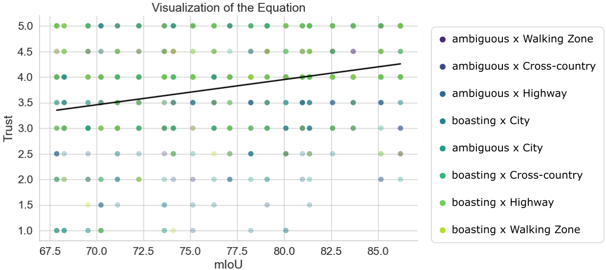

# Understanding the Effects of Different Reliabilities of Automated Vehicle Functionality on the Calibration of Trust

This repository contains code and analyses exploring the relationship between mean Intersection over Union (mIoU) and trust in the context 
of autonomous vehicle (AV) reliability visualization. Key methods include Random Forest feature importance evaluation, symbolic regression, 
and a multilayer perceptron model. Below is a summary of the key components:

### 1. Feature Importance Analysis
We utilized a `RandomForestRegressor` from `scikit-learn` to determine the importance of mIoU and other features (e.g., demographic factors) 
for predicting trust. Results showed that mIoU is a significant predictor, with a feature importance score of ~23%.

### 2. Symbolic Regression with PySR
We employed the `PySR` library to derive mathematical expressions linking mIoU and trust. 
Symbolic regression revealed a weak initial correlation (R²=0.01), prompting data filtering to focus on participants whose trust levels 
varied significantly. The best-performing equation was:

Filtered data plots demonstrated diverse trust-mIoU relationships, ranging from ascending trends to seemingly random distributions.

### 3. Multilayer Perceptron Trust Estimation
We trained a multilayer perceptron (MLP) on ten features, including mIoU, demographics, and scenario data. The model achieved:
- **Accuracy:** 74.2%
- **F1 Score:** 74.2%

We split the dataset into a train (N=2124), validation (N=265), and test (N=267) dataset. 
We trained our classifier for 266000 steps, with a batch size of 16, and using the AdamW optimizer with a constant learning rate of 
0.0001, \beta_1=0.9, \beta_2=0.999, eps=1e-08 and weight decay of 0.1. 
To prevent overfitting, we use a dropout rate of 0.5 in each layer. Finally, after the training converges, 
we evaluate our classifier using our test dataset. The model's performance is measured using accuracy (74.2%) and the F1 score (74.2%). 
These results indicate that our model can capture the correlation between input parameters and the ground truth and, thus, 
can estimate the level of trust based on ten given variables mIoU, scenario, introduction, gender, age, education, jobs, driver's license, 
driving frequency, and driven distance. For the classification task, we used 5 classes for trust estimation, ranging from level 1 to level 5. 
The ten input parameters are converted to one hot encoded vector for categorical variables and scalar values. 

Model architecture included 4 layers with dimensions `[128, 512, 1024, 1024]` and a dropout rate of 0.5 to prevent overfitting.

The progression of training over the epochs can be seen here:

### 4. Open Feedback
Participants provided qualitative feedback on the visualization reliability and its impact on trust. Many participants appreciated the concept, though some noted the need for clearer or more diverse visualizations. Examples include:
- *“The more videos I watched, the more I felt comfortable with the system.”*
- *“Some of the videos had distracting artifacts which impacted my trust level.”*

### Tools and Libraries Used
- **Python Libraries:** `scikit-learn`, `PySR`, `numpy`, `pandas`, `matplotlib`, `torch`, `shap`, `xgboost`, `lightgbm`, `catboost`
- **MLP Framework:** PyTorch with `AdamW` optimizer

