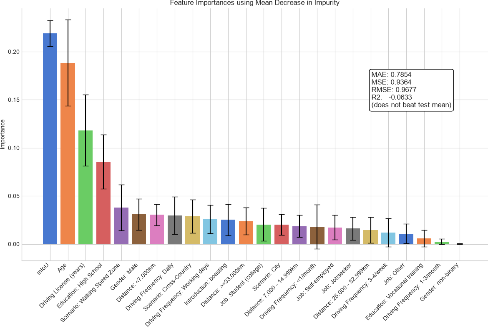
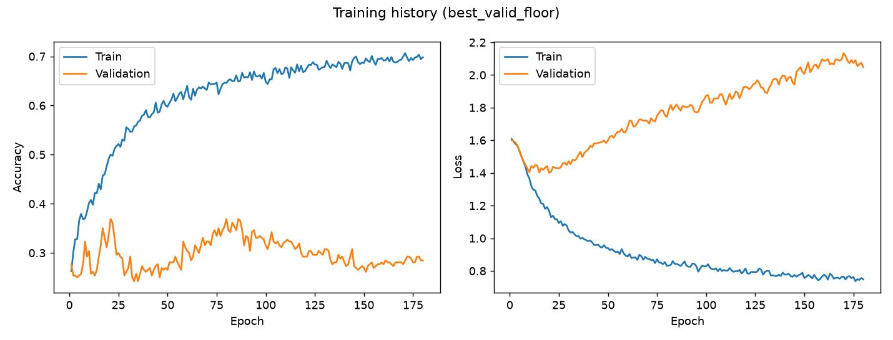
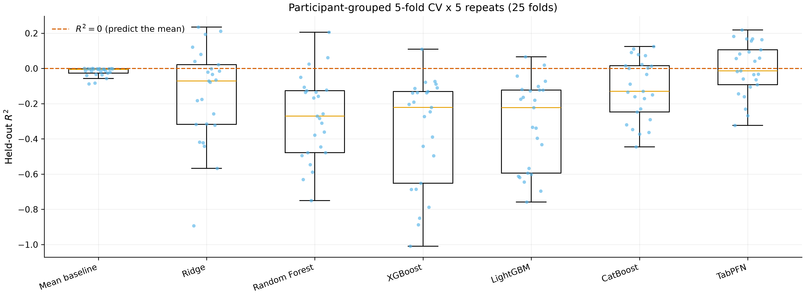

# Understanding the Effects of Different Reliabilities of Automated Vehicle Functionality on the Calibration of Trust

This repository contains the full analysis pipeline for studying how the mean Intersection over Union (mIoU) of AV perception outputs relates to human trust calibration. The code covers feature-importance analysis with multiple ML models, symbolic regression via PySR, and a multilayer perceptron (MLP) trust classifier trained on reliability, demographic, and contextual variables.

---

## Table of Contents

1. [Research Background](#research-background)
2. [System Requirements](#system-requirements)
3. [Installation](#installation)
4. [Project Structure](#project-structure)
5. [Data Schema](#data-schema)
6. [Reproducibility](#reproducibility)
7. [Running the Analyses](#running-the-analyses)
   - [Cross-Validated Model Comparison (cross_validation.py)](#0-cross-validated-model-comparison)
   - [Feature Importance (ML-approaches.py)](#1-feature-importance-ml-approachespy)
   - [Symbolic Regression — Basic (main_pysr_trust_calibration.py)](#2-symbolic-regression--basic)
   - [Symbolic Regression — Group-based (main_group_pysr_trust_calibration.py)](#3-symbolic-regression--group-based)
   - [Symbolic Regression — More Predictors (main_group_pysr_trust_calibration_more_predictors.py)](#4-symbolic-regression--more-predictors)
   - [Symbolic Regression — Personalized (main_personalized_pysr_trust_calibration.py)](#5-symbolic-regression--personalized)
   - [MLP Classifier — Training](#6-mlp-classifier--training)
   - [MLP Classifier — Evaluation](#7-mlp-classifier--evaluation)
   - [Running Several Pipelines at Once (run_all.py)](#8-running-several-pipelines-at-once)
   - [Publication Figures](#9-publication-figures)
   - [Advanced Explainability](#10-advanced-explainability)
   - [Mixed-Effects Baseline](#11-mixed-effects-baseline)
8. [Configuration Reference](#configuration-reference)
9. [Output Artifacts](#output-artifacts)
10. [Running Tests](#running-tests)
11. [Troubleshooting](#troubleshooting)
12. [Results Summary](#results-summary)
13. [Tools and Libraries](#tools-and-libraries)
14. [Citation](#citation)

---

## Research Background

Autonomous vehicles (AVs) rely on perception systems to understand their environment. The **mIoU** (mean Intersection over Union) is a standard metric quantifying how accurately a perception model delineates objects — higher mIoU means more reliable perception. This project investigates:

- How much does mIoU drive human trust in AV systems?
- Do presentation style (boasting vs. ambiguous introduction) and driving scenario (highway, city, walking zone, cross-country) moderate this relationship?
- Can symbolic equations describe the mIoU–trust relationship at the individual and group level?
- How accurately can a deep model classify human trust levels from reliability and demographic features?

### Experimental design

The study uses a **mixed (split-plot) design**:

| Factor | Type | Levels |
|---|---|---|
| `mIoU` | **Within**-subjects | 20 values, all seen by every participant |
| `INTRODUCTION` | **Between**-subjects | 2 (`ambiguous`, `boasting`) |
| `SCENARIO` | **Between**-subjects | 4 (highway, city, walking zone, cross-country) |

Each participant is assigned to exactly **one** INTRODUCTION condition and **one** SCENARIO, and rates trust after each of 20 videos whose mIoU varies. That yields 8 between-subject cells of 14–18 participants each, and 20 repeated measures per participant.

This matters for the analysis: mIoU is the only factor that varies *within* a participant, so the repeated-measures structure applies to mIoU and its interactions, while the INTRODUCTION and SCENARIO main effects are estimated *between* participants. See [Mixed-Effects Baseline](#11-mixed-effects-baseline).

---

## System Requirements

| Requirement | Minimum |
|---|---|
| Python | 3.11+ (CI runs the suite on 3.11, 3.12, 3.13 and 3.14) |
| RAM | 8 GB (16 GB recommended for TabPFN) |
| Disk | ~2 GB for all dependencies |
| GPU | Optional; CUDA-enabled GPU speeds up MLP training and some models |
| OS | Windows, macOS, or Linux |

> **PySR dependency on Julia:** PySR uses Julia under the hood for symbolic regression. On the first run, PySR will automatically download and install a bundled Julia runtime — no manual Julia installation is needed. This repository pins **PySR 2.0.0b2** (SymbolicRegression.jl 2.0.0-beta.8); `tests/test_pysr_api_compat.py` guards the parts of the PySR API the pipelines depend on, so a beta bump fails in seconds instead of hours into a search.

---

## Installation

```bash
# 1. Create and activate a virtual environment
python -m venv .venv
# Windows:
.venv\Scripts\activate
# macOS/Linux:
source .venv/bin/activate

# 2a. Reproducing the published results — install the exact pinned environment
pip install --upgrade pip
pip install -r requirements.lock

# 2b. Or, for development, install the supported version ranges
pip install -r requirements.txt

# 3. Install development dependencies (needed to run tests)
pip install -r requirements-dev.txt
```

**Which of `requirements.lock` and `requirements.txt` do I want?**

| File | Contents | Use it when |
|---|---|---|
| `requirements.lock` | The exact transitive closure (90 pinned packages) the committed results were produced with | Reproducing the numbers in this README |
| `requirements.txt` | Supported version ranges for the ~22 direct dependencies | Developing, or deliberately testing a newer stack |

Regenerate the lock after changing `requirements.txt` with `python tools/make_lock.py`; CI installs from the lock in a separate job so a lock that no longer resolves is caught.

> The first `import pysr` call will trigger Julia installation and precompilation. Expect a few minutes on the first run.

---

## Project Structure

```
.
├── data/                          # Preprocessed Excel datasets
│   ├── all_combined_prepared.xlsx
│   ├── all_combined_prepared_removed_REI.xlsx
│   ├── all_combined_prepared_with_demographics.xlsx
│   └── all_combined_prepared_with_demographics_with_baseline.xlsx
│
├── MLP/                           # Deep learning pipeline
│   ├── __init__.py
│   ├── dataset.py                 # PyTorch Dataset, participant-grouped split, encoders
│   ├── network.py                 # Configurable MLP with nominal / CORAL-ordinal heads
│   ├── metrics.py                 # Ordinal metrics, cluster bootstrap, majority baseline
│   ├── train.py                   # Seeded training loop with early stopping
│   ├── eval.py                    # Checkpoint evaluation, confusion matrix, calibration
│   └── epochs/                    # Training curve snapshots (generated)
│
├── results/                       # All generated figures and text outputs
│   ├── ML-Approaches/
│   ├── PySR/
│   │   ├── split_groups/
│   │   ├── split_groups_personalized/
│   │   ├── more_predictors/
│   │   └── personalized_plots/
│   └── MLP/
│
├── tests/                         # Automated test suite
│   ├── test_data_integrity.py
│   ├── test_ml_approaches.py
│   ├── test_mlp_encoding.py
│   ├── test_mlp_label_modes.py
│   ├── test_mlp_metrics.py        # Ordinal metrics + cluster bootstrap
│   ├── test_mlp_network.py        # CORAL ordinal head semantics
│   ├── test_pysr_api_compat.py    # Guards the PySR 2.0 API surface
│   ├── test_pysr_helpers.py
│   ├── test_repo_assets.py        # README paths resolve; results JSON parses
│   └── test_splits.py             # No participant on both sides of any split
│
├── tools/
│   └── make_lock.py               # Regenerates requirements.lock
│
├── ML-approaches.py               # ML baselines and feature-importance workflows
├── cross_validation.py            # Repeated participant-grouped CV (headline metrics)
├── mixed_effects_baseline.py      # Linear mixed-effects baseline (ICC, moderation)
├── publication_figures.py         # Forest plot, rank heatmap, mIoU-trust panel, PDP/ICE
├── explainability_extras.py       # SHAP interactions, DiCE counterfactuals, Anchors
├── main_pysr_trust_calibration.py                          # PySR: per intro/scenario subset
├── main_group_pysr_trust_calibration.py                    # PySR: equal-group splitting
├── main_group_pysr_trust_calibration_more_predictors.py    # PySR: multi-feature model
├── main_personalized_pysr_trust_calibration.py             # PySR: per-participant
├── pysr_config.py                 # Shared PySR search config + --seed/--deterministic flags
├── pysr_plots.py                  # Shared scatter + fitted-curve figure
├── trust_groups.py                # Canonical equal-trust group detection
├── plotting_style.py              # Colour-blind-safe palette and figure defaults
├── run_all.py                     # Cross-platform pipeline runner (replaces the .bat files)
├── pyproject.toml                 # Ruff + pytest configuration, project metadata
├── requirements.txt               # Supported version ranges
├── requirements.lock              # Exact pinned environment for reproduction
└── requirements-dev.txt
```

---

## Data Schema

All datasets are Excel files with `Sheet1`. Columns vary by file:

### Core columns (all files)

| Column | Type | Description |
|---|---|---|
| `ProlificID` | string / int | Participant identifier — see the note below |
| `mIoU` | float, **0–100 scale** | Perception reliability for the shown video. Observed range `[67.87, 86.20]` across 20 distinct values |
| `trust` | float {1.0, 1.5, …, 5.0} | Aggregated trust rating on a 1–5 scale (half-steps possible). Mean ≈ 4.02, i.e. strongly ceiling-skewed |
| `Trust1`–`Trust5` | float | Individual trust sub-scale items |
| `SCENARIO` | string | Driving scenario — **label set differs by file**, see below |
| `INTRODUCTION` | string | System intro style: `ambiguous` (spelled `ambigious` in the baseline file) or `boasting` |

> **mIoU is a percentage, not a fraction.** Values run 67.87–86.20. Anything that rescales, centers, or feeds mIoU into an exponential/power operator has to account for this — see [Configuration Reference](#configuration-reference).

#### SCENARIO label sets

The two label sets refer to the same four scenarios. Code that filters on scenario names must match the file it is reading.

| Scenario | `all_combined_prepared*.xlsx` | `*_with_demographics*.xlsx` |
|---|---|---|
| Highway (3-lane) | `Highway` | `3Spurig` |
| City | `City` | `NeueMitte` |
| Walking zone | `Walking Zone` | `Spielstrasse` |
| Cross-country | `Cross-country` | `Ueberland` |

#### Participant identifiers

| File | `ProlificID` contents |
|---|---|
| `all_combined_prepared.xlsx` | Real Prolific IDs — 130 participants |
| `all_combined_prepared_removed_REI.xlsx` | Real Prolific IDs — 130 participants |
| `all_combined_prepared_with_demographics.xlsx` | **Constant `1`** — no participant structure |
| `all_combined_prepared_with_demographics_with_baseline.xlsx` | Real Prolific IDs — 134 participants |

Any analysis that groups or splits by participant must use one of the three files with real IDs. `all_combined_prepared_with_demographics.xlsx` cannot support a grouped split or a per-participant partition.

### Additional columns (demographics files)

| Column | Type | Description |
|---|---|---|
| `Age` | int | Participant age in years |
| `Gender` | string `A1`–`A4` | F / M / non-binary / prefer not to say (only `A1`–`A3` observed) |
| `Education` | string `A1`–`A5` | Secondary / Middle / High School / College / Vocational (only `A3`–`A5` observed) |
| `Job` | string `A1`–`A6` | Student (school) / Student (college) / Employee / Self-employed / Jobseeker / Other (`A1` not observed) |
| `License` | **int** | **Years** the participant has held a driving licence (range 1–42). Correlates r ≈ 0.92 with `Age` |
| `DrivingFrequency` | string `A1`–`A6` | Daily → less than once/month |
| `Distance` | string `A1`–`A5` | Annual kilometres driven (bands) |

> `License` is a count of years, not a `Y`/`N` flag. It belongs in the numeric feature block; passing it through an ordinal/label encoder replaces years with ranks and destroys the scale.

### Dataset variants

| File | Notes |
|---|---|
| `all_combined_prepared.xlsx` | Base dataset — 2600 rows, 130 participants |
| `all_combined_prepared_removed_REI.xlsx` | REI (Rational–Experiential Inventory) participants removed — 2310 rows |
| `all_combined_prepared_with_demographics.xlsx` | Base + demographics, 2656 rows. **`ProlificID` is a constant** — do not use for grouped analyses |
| `all_combined_prepared_with_demographics_with_baseline.xlsx` | Demographics + baseline trust, 2788 rows, 134 participants. The only file with both demographics and real IDs, so all grouped analyses use it |

---

## Reproducibility

Every stochastic step in this repository is seeded, and every generated artifact
records the seed it came from. Three things are worth knowing before you try to
regenerate a number.

**1. The environment is pinned.** `requirements.lock` holds the exact transitive
closure the committed results were produced with. `requirements.txt` holds
supported ranges and will drift.

**2. PySR needs `--deterministic`, not just `--seed`.** PySR's search is
stochastic *and* multithreaded, so a seed alone does not determine the result.
`--deterministic` forces `parallelism="serial"`, which is the only mode whose
equations can be regenerated — and is considerably slower. All four PySR scripts
take the same flags:

```bash
python main_pysr_trust_calibration.py --seed 0 --deterministic
```

`write_model_info` stamps a `PROVENANCE` block into every
`results/PySR/model_info_*.txt` it writes, recording the PySR version, seed,
parallelism mode and whether the run was reproducible at all, so an equation
states its own status:

```
PROVENANCE
pysr_version: 2.0.0b2
random_state: 0
deterministic: True
parallelism: serial
reproducible: yes
```

Running without `--deterministic` logs a warning saying the output will not be
reproducible.

> ⚠️ **The equation files currently committed under `results/PySR/` predate this
> change.** They were produced by the earlier unseeded, threaded search under
> pysr 1.5.10, carry no `PROVENANCE` header, and **cannot be regenerated**. To put
> the symbolic-regression results on the same footing as the rest of the
> repository they need one deterministic re-run
> (`python run_all.py pysr --seed 0 --deterministic`), which takes hours because
> `--deterministic` forces serial search. Until then, treat those equations as
> illustrative rather than reproducible.

**3. The MLP is fully seeded.** `--seed` fixes weight initialisation, dropout
masks and DataLoader shuffle order; `--split-seed` fixes the participant split.
Both are written into the run's report JSON along with the git commit, the torch
version and the exact command line.

Run the whole thing with one command:

```bash
python run_all.py --seed 0                 # everything except the PySR searches
python run_all.py pysr --seed 0 --deterministic
python run_all.py --list                   # show all stages
```

---

## Running the Analyses

### 0. Cross-Validated Model Comparison

**This is where the headline model-comparison numbers come from.** `ML-approaches.py`
scores each model on a single 80/20 participant-grouped split, which leaves ~27
test participants — not enough to tell "this model is worse" from "this split was
unlucky". `cross_validation.py` re-runs the same models under repeated
GroupKFold and reports mean ± SD across folds, plus a paired per-fold comparison
against a mean-predicting baseline.

```bash
python cross_validation.py --folds 5 --repeats 5
python cross_validation.py --folds 5 --repeats 5 --include-tabpfn   # slower
python cross_validation.py --tune                                   # nested tuning, much slower
```

Each repeat reshuffles the participant-to-fold assignment under its own seed, and
every fold asserts that no participant appears on both sides of the boundary.
The mean baseline is evaluated as a model under the identical protocol, so "no
model beats predicting the mean" is a computed result rather than an inference
from a negative R².

**`--tune`** addresses a second confound: comparing an untuned Random Forest
against an untuned XGBoost mixes up "this model is worse" with "this model's
defaults suit this data less well". With `--tune`, each *outer* fold selects its
own hyperparameters via a randomised search over an **inner** GroupKFold on the
training participants only — so tuning never sees the outer test fold, and the
reported score stays an honest generalisation estimate rather than a maximum over
a grid. The chosen parameters are recorded per fold in `cv_metrics.json`. Cost
scales by roughly `--tune-iterations x --tune-inner-folds`, so it is opt-in.

| Argument | Default | Description |
|---|---|---|
| `--folds` / `--repeats` | `5` / `5` | Outer CV shape |
| `--random-state` | `42` | Seeds fold assignment and every model |
| `--include-tabpfn` | off | Add TabPFN (slow) |
| `--tune` | off | Nested participant-grouped hyperparameter search |
| `--tune-iterations` | `20` | Candidates sampled per outer fold |
| `--tune-inner-folds` | `3` | Inner grouped folds used for selection |

**Outputs** → `results/ML-Approaches/`

```
cv_metrics.json                        aggregate + every per-fold score
cv_r2_by_model.png/.pdf                per-fold R² distributions against the R²=0 line
cv_3x1_tuned5x2_metrics.json           a non-default run, named for its protocol
```

The canonical 5×5 untuned run keeps the bare `cv_` name; any other shape encodes
its protocol in the filename, so an exploratory `--folds 3 --repeats 1` run cannot
silently overwrite the committed headline result with a weaker one.

See [Results Summary](#results-summary) for what it found.

---

### 1. Feature Importance (ML-approaches.py)

Trains five regression models (Random Forest, CatBoost, XGBoost, LightGBM, TabPFN) on the demographics dataset and reports per-feature importance with uncertainty estimates.

```bash
python ML-approaches.py
```

**What it does:**
- Random Forest: MDI importance + permutation importance + SHAP bar chart
- CatBoost: native importance with bootstrap standard-deviation error bars
- XGBoost: native importance with per-tree std; saves model to `xgboost_model.json`
- LightGBM: native importance with per-tree std; SHAP beeswarm plot
- TabPFN: zero-shot pre-trained regressor; reports point and quantile predictions

GPU models (CatBoost, XGBoost, LightGBM, TabPFN) fall back to CPU automatically if no compatible GPU is found.

**Outputs** → `results/ML-Approaches/`

```
feature_importance_random_classifier.png
perm_importances_random_regressor.png
enhanced_shap_summary_plot.png
feature_importance_catboost.png
feature_importance_catboost_shap.png
feature_importance_xgboost.png
feature_importance_xgboost_shap.png
feature_importance_lightgbm.png
enhanced_shap_summary_plot_lgboost.png
results_tabpfnregressor.txt
model_metrics.json          single-split metrics — see cross_validation.py for the headline numbers
xgboost_model.json          (untracked; regenerate by running the script)
fact-av.tabpfn_fit          (untracked; regenerate by running the script)
```

> Model binaries (`*.pt`, `*.tabpfn_fit`, `xgboost_model.json`) are deliberately
> **not tracked in git** — they are large, change on every run, and are fully
> regenerable. Figures, metric JSON/CSV and the PySR equation files *are* tracked.
> CatBoost is constructed with `allow_writing_files=False` so it no longer drops a
> `catboost_info/` scratch directory into the working tree on every fit.



---

### 2. Symbolic Regression — Basic

Runs PySR on each (INTRODUCTION, SCENARIO) combination for both the base and REI-filtered datasets to derive explicit mathematical equations relating mIoU to trust.

```bash
python main_pysr_trust_calibration.py
```

**Outputs** → `results/PySR/`

For each combination and dataset:
- `model_info_<intro>_<scenario>_<dataset>.txt` — SymPy expression + LaTeX table
- `relationship_pysr_<intro>_<scenario>_<dataset>.png` — scatter + fitted curve

Plus one pooled fit per dataset:
- `model_info_all_data_<dataset>.txt` — SymPy expression + LaTeX table
- `relationship_pysr_all_data_<dataset>.png` — scatter + fitted curve

> The pooled fit previously wrote only the figure; its equation was computed and discarded.

---

### 3. Symbolic Regression — Group-based

Partitions data by participant (ProlificID) × INTRODUCTION × SCENARIO into **equal-trust groups** (≥14 identical trust ratings, or 2 groups of ≥7) and **other rows**, then fits separate PySR models for each partition. Also fits a per-participant personalized model within the group split.

```bash
python main_group_pysr_trust_calibration.py
```

> **Caveat.** This partition conditions on the *outcome's own variance* — participants who used the trust scale flatly go to the equal-trust group (87 of 130 in the base dataset), the rest to `other_rows_df` (43). Slopes estimated on either side are not unbiased estimates of the mIoU effect, so treat this split as exploratory rather than confirmatory.

**Outputs** → `results/PySR/split_groups/` and `results/PySR/split_groups_personalized/`

Per dataset, in `split_groups/`:

| File | Content |
|---|---|
| `model_info_other_rows_df_<dataset>.txt` | Equation for the high-variance subset |
| `relationship_pysr_other_rows_df_<dataset>.png` | Scatter + curve, with condition legend |
| `relationship_pysr_other_rows_df_stacked_<dataset>.png` | Same fit, legend suppressed |
| `model_info_all_equal_df_<dataset>.txt` | Equation for the equal-trust subset |
| `relationship_pysr_all_equal_df_<dataset>.png` | Scatter + curve |

Per participant, in `split_groups_personalized/`: `model_info_<ProlificID>_<dataset>.txt` and `relationship_pysr_<ProlificID>_<dataset>.png`.

> The two `other_rows_df` figures come from a **single** search. This step previously ran two byte-identical searches of the same data under different filenames, so the resulting equation files could disagree purely because the search is stochastic. The personalized fits now also run for *both* datasets — they previously read a leaked loop variable and silently covered only the last one.

---

### 4. Symbolic Regression — More Predictors

Extends the group-based analysis with a full demographic feature matrix (mIoU, Age, one-hot categoricals, label-encoded ordinals) for the unbalanced participant groups.

```bash
python main_group_pysr_trust_calibration_more_predictors.py
```

> This script reads `all_combined_prepared_with_demographics_with_baseline.xlsx`. It previously read `all_combined_prepared_with_demographics.xlsx`, whose `ProlificID` is a constant — so every cell qualified as an "equal group", `other_rows_df` came out empty, and the script returned at its `len(df) < 3` guard without writing anything. It now also raises if the input has fewer than two distinct participants.

**Outputs** → `results/PySR/more_predictors/`

---

### 5. Symbolic Regression — Personalized

Fits an independent PySR model for each participant across both datasets.

```bash
python main_personalized_pysr_trust_calibration.py
```

> **Caveat.** Each participant contributes exactly 20 rows at 20 distinct mIoU values — one observation per x. Fitting a free-form expression of up to `maxsize=10` nodes from an 18-operator alphabet to 20 points will fit noise; the committed equations include artifacts such as `4.966721 - tan(cos(tan(x0/0.37383464))**6)`. For per-participant slopes, a random-slope mixed-effects model is the better-conditioned tool.

**Outputs** → `results/PySR/personalized_plots/`

- `model_info_<ProlificID>_<dataset>.txt` — SymPy expression + LaTeX table
- `relationship_pysr_<ProlificID>_<dataset>.png` — scatter + fitted curve

> The `.txt` filename now carries the dataset stem, as the `.png` already did. Without it the second dataset's equations overwrote the first's, leaving the two artifacts describing different fits.

---

### 6. MLP Classifier — Training

Trains an MLP (`34 → 64 → 32 → num_classes` by default) on the demographics dataset. The best checkpoint (by **validation** macro-F1) is saved and then evaluated **once** on the held-out test split.

```bash
# Default: 5-class floor-based trust labels (3.5 → class 3, etc.)
python MLP/train.py --seed 0

# Alternative: 9 classes — one per observed half-step (1.0, 1.5, …, 5.0)
python MLP/train.py --trust-label-mode separate_fractional

# The ordinal (CORAL) head, which respects the 1–5 ordering
python MLP/train.py --head ordinal

# The original over-parameterised network, for comparison
python MLP/train.py --hidden 128 512 1024 1024 --dropout 0.5
```

**Arguments**

| Argument | Values | Default | Description |
|---|---|---|---|
| `--trust-label-mode` | `floor`, `separate_fractional` | `floor` | How fractional trust ratings are mapped to class indices |
| `--head` | `nominal`, `ordinal` | `nominal` | Output head — see below |
| `--seed` | int | `0` | Weight init, dropout masks, batch order, bootstrap |
| `--split-seed` | int | `1337` | Participant-grouped split |
| `--epochs` | int | `2000` | Maximum epochs |
| `--patience` | int | `100` | Stop after N epochs without a new best validation macro-F1 (`0` disables) |
| `--hidden` | ints | `64 32` | Hidden layer widths |
| `--dropout` | float | `0.2` | Dropout after each hidden layer |
| `--lr` / `--weight-decay` | float | `1e-3` / `1e-2` | AdamW settings |
| `--bootstrap-n` | int | `2000` | Cluster-bootstrap resamples for the test-metric CIs |

**Network size.** The original architecture was `34 → 128 → 512 → 1024 → 1024 → 5`: ~1.65 M parameters trained on ~2 100 rows, or roughly 750 parameters per training row. It reached its best validation epoch at **epoch 11 of 2000** and memorised the rest, which is why every hidden layer carried `Dropout(0.5)`. The default is now ~4.5 k parameters, which is the right order of magnitude for this sample. The old shape is still one flag away.

**Output heads.** `trust` is an *ordered* 1–5 response, so predicting 1 when the truth is 5 is a worse error than predicting 4 — something plain softmax cross-entropy cannot express. `--head ordinal` implements the CORAL scheme (Cao, Mirjalili & Raschka, 2020): the backbone emits one scalar and the K−1 cumulative logits share it, differing only by a learned threshold, which is what guarantees `P(y>k)` stays monotone. On this data the nominal head nonetheless validates better (validation macro-F1 0.186 vs 0.103), so it remains the default — a choice made on the **validation** split, not on test.

**Early stopping.** The loop previously ran all 2000 epochs even though it recorded the best epoch as 11. `--patience` stops once validation stops improving, turning a multi-minute run into a ~40-second one and making the overfitting a reported fact rather than an accident.

**Label modes explained:**

- **`floor`** — floors each trust value to the nearest integer: 1.5 → class 0, 2.5 → class 1, 3.0 → class 2, 4.5 → class 3. Always produces 5 classes.
- **`separate_fractional`** — each observed trust value (1.0, 1.5, 2.0, …, 5.0) gets its own class. Typically produces 9 classes.

**Training configuration** (all now CLI flags rather than module constants):

| Parameter | Default |
|---|---|
| Max epochs / patience | 2000 / 100 |
| Batch size | 256 |
| Learning rate / weight decay | 1e-3 / 1e-2 |
| Optimizer | AdamW |
| Loss | CrossEntropyLoss, or CORAL `OrdinalLoss` — both with inverse-frequency class weights |
| Data split | 80 / 10 / 10 — **grouped by `ProlificID`**, so no participant spans two splits |
| Split seed | 1337 |
| Checkpoint criterion | Best **validation** macro-F1 (test is touched once, at the end) |

**Test metrics carry confidence intervals.** The test split holds ~14
participants, so a point estimate from it means very little alone. The report
attaches percentile CIs from a **participant-level cluster bootstrap** —
resampling participants, not rows, because each participant contributes ~21
correlated ratings (ICC ≈ 0.69). A row-wise bootstrap would treat ~270
correlated rows as 270 independent draws and report an interval several times too
narrow. The majority-class baseline (constant = modal **training** class) is
computed alongside, and "beats the baseline" is judged on the CI lower bound, not
the point estimate.

**Outputs** → `results/MLP/` and `MLP/epochs/`

```
best_valid_floor.pt                    # Model checkpoint (untracked — regenerable)
best_valid_floor.json                  # Config, environment, split sizes, metrics + CIs, baseline
best_valid_floor_ordinal.{pt,json}     # --head ordinal
best_valid_floor_split42.{pt,json}     # --split-seed 42
train.labels.pdf / .jpg                # Label distribution histogram
valid.labels.pdf / .jpg
test.labels.pdf / .jpg
epochs/history_best_valid_floor.jpg    # Train/validation accuracy and loss curves
```

Each report records the seed, split seed, git commit, torch version, device,
parameter count and the exact command line, so a number can be traced back to the
run that produced it.

**Split sensitivity.** One split is one draw. To check whether a result survives a
different partition of participants, sweep the split seed:

```bash
for s in 1337 7 42 2024 99; do python MLP/train.py --split-seed $s --no-plots; done
```

Non-default split seeds and heads are part of the output filename
(`best_valid_floor_split42.json`, `best_valid_floor_ordinal.json`), so a sweep
writes one artifact per configuration instead of each run overwriting the
canonical `best_valid_floor.json`. See [Results Summary](#mlp-trust-classifier)
for what the sweep found — it matters.



> The 400 `epoch*.jpg` snapshots that used to live in `MLP/epochs/` (11 MB, one
> per 100 epochs, re-plotting the whole history each time so cost scaled
> ~O(epochs²)) were removed. With early stopping the run is ~180 epochs, and one
> history figure per run replaces them.

---

### 7. MLP Classifier — Evaluation

Loads a saved checkpoint, runs inference on the test split, and produces a normalised confusion matrix.

```bash
# Evaluate the default floor-mode checkpoint
python MLP/eval.py

# Evaluate the separate_fractional checkpoint
python MLP/eval.py --trust-label-mode separate_fractional

# Point to a specific checkpoint file
python MLP/eval.py --checkpoint-path path/to/checkpoint.pt
```

**Arguments**

| Argument | Default | Description |
|---|---|---|
| `--trust-label-mode` | `floor` | Must match the mode used during training |
| `--head` | `nominal` | Must match the head used during training |
| `--split-seed` | `1337` | Must match the split seed used during training |
| `--seed` | `0` | Seed for the bootstrap resampling |
| `--bootstrap-n` | `2000` | Cluster-bootstrap resamples |
| `--checkpoint-path` | auto-resolved from mode + head | Explicit path to a `.pt` checkpoint |

The architecture is read back from the checkpoint's `model_config`, so a run
trained with non-default `--hidden`/`--dropout`/`--head` reloads correctly.
Checkpoints predating this field fall back to the original 128/512/1024/1024
nominal network.

**Outputs** → `results/MLP/`

```
confusion_matrix.pdf / .png             # floor mode, annotated with QWK + MAE + F1
confusion_matrix_separate_fractional.pdf / .png
calibration.pdf / .png                  # reliability diagram + confidence histogram (ECE)
calibration_separate_fractional.pdf / .png
per_class_metrics.csv                   # per-class precision / recall / F1 / support
per_class_metrics_separate_fractional.csv
```

In addition to accuracy and macro-F1, the evaluator reports:

- **Quadratic-Weighted Kappa (QWK)** — ordinal-aware agreement; rewards predictions that are close to the true class even if not exact. Standard for ordinal targets like Likert ratings.
- **MAE in trust units** — average distance between the predicted and true trust value on the original 1–5 scale.
- **Expected Calibration Error (ECE)** — average gap between predicted confidence and empirical accuracy, summarising the reliability diagram as a scalar. Lower is better.

---

### 8. Running Several Pipelines at Once

`run_all.py` replaces the old *all_pysr.bat* and *MLP/all_mlp.bat* (both removed). Those were
Windows-only while this README advertises macOS and Linux support, and they
swallowed failures: every `python x.py` line ran whether or not the previous one
crashed, so a broken stage was invisible unless you scrolled back through the
output.

```bash
python run_all.py --list                          # show every stage
python run_all.py                                 # ml, cv, mlp, stats, figures
python run_all.py pysr --seed 0 --deterministic   # the symbolic-regression searches
python run_all.py ml cv --dry-run                 # print the commands only
```

It stops at the first failing stage (`--keep-going` to override), forwards
`--seed` to every stage that accepts one, and prints a pass/fail/duration summary
at the end. The `pysr` group is opt-in because those searches take hours.

---

### 9. Publication Figures

Generates four reviewer-grade figures consolidating model behaviour. All figures use a colorblind-safe Okabe-Ito palette and standardised typography defined in `plotting_style.py`.

```bash
python publication_figures.py
```

**What it produces** → `results/publication/`

| File | Content |
|---|---|
| `forest_feature_importance.{pdf,png}` | Cross-model normalized feature importance comparison (one row per feature, one marker per model) |
| `importance_rank_heatmap.{pdf,png}` | Companion heatmap showing per-feature rank stability across RF, XGBoost, LightGBM, CatBoost |
| `miou_trust_panel.{pdf,png}` | 2×2 panel of mIoU → trust curves (one scenario per panel, ambiguous vs boasting overlaid) with bootstrap 95% bands |
| `pdp_ice_miou_by_cell.{pdf,png}` | Partial dependence + ICE for mIoU across the 8 (INTRODUCTION × SCENARIO) cells |
| `model_importances_raw.csv` | Tidy importance values used as input to the forest plot |

All models use a participant-grouped train/test split (`GroupShuffleSplit` on `ProlificID`) to prevent leakage across the splits.

---

### 10. Advanced Explainability

Extends the existing SHAP bar/beeswarm plots with three new outputs aimed directly at the moderation hypotheses (does mIoU × INTRODUCTION or mIoU × SCENARIO matter?).

```bash
python explainability_extras.py
```

**What it produces** → `results/publication/explainability/`

| File | Content |
|---|---|
| `shap_interaction_heatmap.{pdf,png}` | Mean absolute pairwise SHAP interaction strength across all features |
| `shap_top_interactions.csv` | Ranked table of the 15 strongest feature×feature interactions |
| `shap_miou_moderation.{pdf,png}` | SHAP(mIoU) coloured by INTRODUCTION (panel A) and SCENARIO (panel B) — directly visualises moderation |
| `dice_counterfactuals.csv` | DiCE-generated minimal feature changes that would flip a low-trust prediction to high-trust |
| `dice_feature_change_frequency.{pdf,png}` | How often each feature is suggested for change across counterfactual examples |
| `anchors_rules.txt` | Local high-precision IF–THEN rules. Uses `alibi.AnchorTabular` when available; otherwise falls back to a shallow surrogate decision tree |

> `alibi` does not build cleanly on every Windows install; the script transparently uses the surrogate-tree fallback when import fails.

---

### 11. Mixed-Effects Baseline

The study uses a within-subjects design — every participant rates trust across multiple mIoU values, two INTRODUCTION conditions and four SCENARIOs. Treating each row as i.i.d. (as the ML baselines do) violates the repeated-measures structure. This script fits a linear mixed-effects (LME) model with a random intercept per participant and tests the moderation hypotheses directly.

```bash
python mixed_effects_baseline.py
```

**Three nested models are fit and compared (likelihood-ratio + AIC + BIC):**

| Model | Fixed effects |
|---|---|
| `M0` | (intercept only — null variance decomposition) |
| `M1` | mIoU, INTRODUCTION, SCENARIO |
| `M2` | M1 + mIoU × INTRODUCTION + mIoU × SCENARIO interactions |

**What it produces** → `results/publication/mixed_effects/`

| File | Content |
|---|---|
| `summary_M0.txt` / `summary_M1.txt` / `summary_M2.txt` | Full statsmodels textual summaries |
| `model_comparison.csv` | AIC, BIC, log-likelihood, LR test for nested model comparison |
| `fixed_effects_M2.csv` | Tidy coefficient table with 95% CIs and p-values |
| `icc.json` | Intraclass correlation + between-vs-within-participant variance decomposition |
| `fixed_effects_forest.{pdf,png}` | Coefficient forest plot for M2 with 95% CIs (significant effects highlighted) |
| `interaction_marginal_effects.{pdf,png}` | Predicted-trust curves over mIoU per (INTRODUCTION × SCENARIO) cell from M2 |
| `summary_M2_random_slope.txt` | M2 refitted with a random slope for mIoU (sensitivity check) |
| `fixed_effects_M2_random_slope.csv` | Side-by-side mIoU-term estimates, SEs and p-values: random intercept vs random slope |
| `random_slope_sensitivity.json` | Log-likelihoods, convergence status, and the mIoU SD used for rescaling |

#### Random-slope sensitivity check

M0–M2 specify a **random intercept only**, which assumes every participant shares one mIoU slope. Since mIoU is the *within*-subject factor (INTRODUCTION and SCENARIO vary only between participants), that assumption is what the moderation p-values rest on. `fit_random_slope_sensitivity()` refits M2 with `re_formula="~mIoU_sd"` and reports both side by side.

| mIoU term | Random intercept | + Random slope |
|---|---|---|
| `mIoU` | p = 0.071 | p = 0.301 |
| `mIoU × INTRODUCTION[boasting]` | p = 0.197 | p = 0.466 |
| **`mIoU × SCENARIO[NeueMitte]`** | **p = 0.0013** | **p = 0.069** |
| `mIoU × SCENARIO[Spielstrasse]` | p = 0.936 | p = 0.981 |
| `mIoU × SCENARIO[Ueberland]` | p = 0.254 | p = 0.521 |

The **point estimates are essentially unchanged** (0.0964 → 0.0961 for the City interaction); only the standard errors move, uniformly by ~1.76×. That is the expected signature of a random-effects correction on a balanced within-subject design: the effect size was fine, the uncertainty was understated. Adding the random slope improves the log-likelihood substantially (−2369.2 → −2293.7), so the data clearly support participant-specific mIoU slopes.

**Consequence:** the mIoU × City moderation does not reach p < 0.05 under the better-specified model. Which model to report is a call for the authors; both are written out, and M2 and all published figures are left untouched.

> **Predictor scale matters here.** mIoU is on a 0–100 scale, so `mIoU_c` spans about [−8.8, +9.6]. Against a random-intercept variance near 1.4, a random slope on that scale does not converge — statsmodels exhausts lbfgs and cg, reports a non-positive-definite Hessian, and returns SEs inflated by a uniform ~13× across *every* coefficient, which is an artifact rather than a correction. The sensitivity check therefore expresses mIoU in standard-deviation units (1 unit = 5.554 mIoU points). That is a pure reparameterisation of the fixed effects — the random-intercept p-values are identical either way — and it converges with no warnings. `random_slope_sensitivity.json` records `random_slope_trustworthy` so a non-converged fit cannot be mistaken for a result.

> The script uses `data/all_combined_prepared_with_demographics_with_baseline.xlsx` because it is the only file that retains real ProlificIDs (134 participants).

---

## Configuration Reference

### ML-approaches.py (`Config` dataclass)

Edit the `Config` class at the top of `ML-approaches.py`:

```python
@dataclass
class Config:
    data_path: Path = Path("data") / "all_combined_prepared_with_demographics_with_baseline.xlsx"
    results_path: Path = Path("results") / "ML-Approaches"
    sheet_name: str = "Sheet1"
    test_size: float = 0.2          # Fraction of *participants* held out for testing
    random_state: int = 42
    bootstrap_n: int = 10           # CatBoost error-bar resamples
    target_column: str = "trust"
    group_column: str = "ProlificID"  # Split unit — keeps participants out of both splits
```

### PySR scripts (`pysr_config.py`)

All four PySR scripts share one search configuration in `pysr_config.py`, which exposes `create_model()` and `write_model_info()`. Tune these parameters to control search quality vs. runtime:

| Parameter | Default | Effect |
|---|---|---|
| `niterations` | 300 (basic script) / 500 (others) | More iterations = longer search, potentially better equations |
| `maxsize` | 10 | Maximum expression complexity (nodes in the expression tree) |
| `ncycles_per_iteration` | 2500 | Evolutionary cycles per iteration |
| `precision` | 32 | Float precision (`16`, `32`, or `64`) |
| `turbo` | `True` | Enable Julia LoopVectorization for faster evaluation |
| `batching` | `False` | Pinned explicitly — see the PySR 2.0 note below |
| `random_state` | `0` (via `--seed`) | Search seed. **Not sufficient on its own** — see below |
| `deterministic` | `False` (via `--deterministic`) | Repeatable search. Forces serial execution, so much slower |

**Reproducing a specific run.** PySR's search is stochastic *and* multithreaded, so `random_state` alone does **not** make a run reproducible. All four scripts share `--seed` / `--deterministic` / `--parallelism` flags via `pysr_config.add_search_args`:

```bash
python main_pysr_trust_calibration.py --seed 0 --deterministic
```

`--deterministic` forces `parallelism="serial"`, which is considerably slower — use it for a final run, not for exploration. Running without it logs a warning, and `write_model_info` stamps a `PROVENANCE` header into every `model_info_*.txt` recording the PySR version, seed, parallelism and whether the equation is reproducible at all.

**PySR 2.0.** This repo pins **`pysr==2.0.0b2`** (SymbolicRegression.jl 2.0.0-beta.8). Every keyword in `pysr_config.py` is accepted by 1.5.10, 2.0.0-alpha.11 and 2.0.0b2 alike. Two defaults moved across the major version:

| Parameter | 1.5.10 | 2.0.x |
|---|---|---|
| `batching` | `False` | `"auto"` (enables minibatching when `len(X) > 1000`) |
| `batch_size` | `50` | `None` (auto-selects 128 for `N < 5000`) |

`batching` is therefore pinned to `False` in `create_model()`. Left at the 2.0 default it would silently switch the fits on 2600/2310 rows (`run_all_data`) and on `all_equal_df` (1740 rows) from full-sample MSE to a 128-row minibatch MSE, changing which equations the search finds. `tests/test_pysr_api_compat.py` guards this and the rest of the API surface — run `pytest tests/test_pysr_api_compat.py` after any PySR upgrade.

> `ncyclesperiteration` (no underscores) still works but is deprecated and emits a `FutureWarning`. Use `ncycles_per_iteration`. The PySR scripts no longer call `warnings.filterwarnings("ignore")` at import, so warnings like this are now visible.

One private helper did change shape across the 2.0 betas:
`_maybe_create_inline_operators` — which backs the custom `cos2` / `quart` / `inv`
operators — went from `binary_operators=`/`unary_operators=` lists (1.5.10) to an
`operators={arity: [...]}` dict with an `expression_spec=` argument (2.0.0a11) to
the same dict with a plain `supports_sympy: bool` (2.0.0b2). The guard test
dispatches on the actual parameter names rather than a version string, so the
next beta either passes or fails with the observed signature in the message.

### Shared PySR helpers

| Module | Contains |
|---|---|
| `pysr_config.py` | `create_model()`, `write_model_info()`, `add_search_args()`, `model_factory()` |
| `pysr_plots.py` | `save_relationship_plot()` — the scatter + fitted-curve figure all four scripts draw |
| `trust_groups.py` | `find_equal_groups()`, `split_groups()` — the equal-trust split |

`find_equal_groups` previously existed twice, in `main_group_pysr_trust_calibration.py`
and `main_group_pysr_trust_calibration_more_predictors.py`, with one returning a
`list` and the other a `set`. The plotting block existed in five near-identical
copies that had already drifted apart. Both now have one implementation.

### MLP hyperparameters

Every hyperparameter is a CLI flag — see [MLP Classifier — Training](#6-mlp-classifier--training). `python MLP/train.py --help` lists them all.

---

## Output Artifacts

| Path | Produced by | Description |
|---|---|---|
| `results/ML-Approaches/feature_importance_*.png` | `ML-approaches.py` | Feature importance bar charts |
| `results/ML-Approaches/model_metrics.json` | `ML-approaches.py` | MAE / MSE / RMSE / R² for all models, **single split** |
| `results/ML-Approaches/cv_metrics.json` | `cross_validation.py` | Repeated-CV aggregate + per-fold scores — **the headline metrics** |
| `results/ML-Approaches/cv_r2_by_model.png` | `cross_validation.py` | Per-fold R² distributions vs the R²=0 line |
| `results/ML-Approaches/xgboost_model.json` | `ML-approaches.py` | Serialised XGBoost model *(untracked)* |
| `results/PySR/**/*.txt` | PySR scripts | Discovered equations, with a `PROVENANCE` header |
| `results/PySR/**/*.png` | PySR scripts | Scatter + fitted-curve visualisations |
| `results/MLP/best_valid_*.pt` | `MLP/train.py` | Best model checkpoint *(untracked)* |
| `results/MLP/best_valid_*.json` | `MLP/train.py` | Config, environment, metrics with CIs, baseline |
| `results/MLP/eval_metrics*.json` | `MLP/eval.py` | Evaluation metrics with CIs and ECE |
| `results/MLP/confusion_matrix*.pdf/.jpg` | `MLP/eval.py` | Normalised confusion matrix |
| `MLP/epochs/history_*.jpg` | `MLP/train.py` | Train/validation accuracy and loss curves |

*(untracked)* = deliberately excluded from git via `.gitignore`: large, changes every
run, fully regenerable. Everything else in the table is tracked.

---

## Running Tests

Install development dependencies if you have not already:

```bash
pip install -r requirements-dev.txt
```

Run the full suite:

```bash
pytest
```

The PySR guard tests import Julia, which takes minutes on a cold cache. Skip them
for a fast loop:

```bash
pytest --ignore=tests/test_pysr_api_compat.py
```

Run a specific file or test:

```bash
pytest tests/test_mlp_encoding.py
pytest tests/test_ml_approaches.py::TestConfig::test_default_target_column
```

Lint and format (CI enforces both):

```bash
ruff check .
ruff format --check .
```

### Test suite overview

| File | What it covers |
|---|---|
| `test_splits.py` | **No participant appears on both sides of any split** — checked for all four splitters (`ML-approaches`, the MLP 3-way split, `explainability_extras`, repeated GroupKFold) |
| `test_mlp_metrics.py` | Ordinal metrics, the participant-level cluster bootstrap, the majority baseline |
| `test_mlp_network.py` | CORAL ordinal head: monotone cumulative probabilities, valid class probabilities, loss ordering |
| `test_data_integrity.py` | Data files exist and contain required columns |
| `test_ml_approaches.py` | `Config`, `DataProcessor`, `prepare_categorical_as_string`, `get_tabpfn_quantile_columns` |
| `test_mlp_encoding.py` | All encoding functions (`encode_scenario`, `encode_intro`, `encode_trust_value`, etc.) |
| `test_mlp_label_modes.py` | `floor` and `separate_fractional` label-mapping logic |
| `test_pysr_helpers.py` | `find_equal_groups`, `split_groups`, `build_feature_matrix` |
| `test_pysr_api_compat.py` | The PySR API surface `pysr_config.py` depends on — kwargs, defaults, export methods, custom-operator contract. Run this after any PySR upgrade |
| `test_repo_assets.py` | Every path the README names resolves; results JSON parses; no test-score-named checkpoints |

**What the split tests are for.** The study is repeated-measures — each
participant contributes ~21 ratings — so a row-wise split lets a model memorise a
participant's rating level from their training rows and reuse it on their test
rows. Every held-out metric would be optimistically biased and *nothing in the
output would look wrong*. `test_splits.py` is the guard for that, and it is the
single most important file in the suite.

**CI.** Four jobs: `lint` (ruff check + format), `pytest` (the suite on Python
3.11–3.14), `pysr-api` (the Julia-backed guard tests, with the Julia depot cached
on the pysr pin), and `lockfile` (installs `requirements.lock` exactly and runs
the suite, so a lock that no longer resolves is caught). Dependencies are
installed without `--upgrade`, so CI cannot silently start or stop passing due to
an unrelated release.

---

## Troubleshooting

### PySR / Julia installation fails

PySR downloads a Julia runtime on first use via `juliacall`. If this fails due to network restrictions, set `JULIA_DEPOT_PATH` to point at an existing Julia installation.

> The old `pysr.install()` entry point has been removed — calling it only emits a `FutureWarning`. Julia is now initialised automatically at import time.

PySR 2.0 additionally resolves SymbolicRegression.jl from a **git URL at a pinned revision** rather than from the Julia registry, so the first import needs `git` on `PATH` plus network access.

### CUDA / GPU not detected

The scripts detect GPU availability via `torch.cuda.is_available()`. All GPU-accelerated models fall back to CPU automatically. To force CPU explicitly, unset `CUDA_VISIBLE_DEVICES`:

```bash
# Linux / macOS
CUDA_VISIBLE_DEVICES="" python ML-approaches.py

# Windows PowerShell
$env:CUDA_VISIBLE_DEVICES=""; python ML-approaches.py
```

### `ModuleNotFoundError: No module named 'torch'`

PyTorch is listed in `requirements.txt`. Install it:

```bash
pip install torch>=2.0.0
```

For GPU support with a specific CUDA version see [https://pytorch.org/get-started/locally/](https://pytorch.org/get-started/locally/).

### MLP evaluation fails with class count mismatch

The checkpoint stores the number of classes used during training. If you try to evaluate with a different `--trust-label-mode` than was used for training, you will see:

```
ValueError: Checkpoint expects N classes but dataset mode '...' resolves to M classes.
```

Pass `--trust-label-mode` to `eval.py` matching the mode that was used in `train.py`, or provide `--checkpoint-path` pointing to the right file.

### Data file not found

Scripts expect data files relative to the working directory. Run all scripts from the repository root:

```bash
# Always run from the repo root, not from inside MLP/ or results/
cd /path/to/FACT-AV
python ML-approaches.py
python MLP/train.py
```

`run_all.py` sets the correct working directory for each stage, so it works from anywhere.

### `catboost_info/` keeps appearing in `git status`

It should not any more: CatBoost is constructed with `allow_writing_files=False`,
and the directory was untracked (it was previously *both* gitignored **and**
tracked, which meant the ignore rule had no effect and every run dirtied the
tree). If an older CatBoost still writes it, the `.gitignore` entry catches it.

### A checkpoint fails to load with a size mismatch

The architecture is now configurable, and the checkpoint records it under
`model_config`. A checkpoint trained with `--hidden 128 512 1024 1024` reloads
correctly because `eval.py` reads that field. Checkpoints written before the field
existed fall back to the original 128/512/1024/1024 nominal network — if you have
one from a differently-shaped run, pass `--hidden`/`--head` matching how it was
trained, or simply retrain (it now takes under a minute).

### TabPFN quantile prediction fails on CUDA

Fixed in the pinned `tabpfn>=8.4.0`. `ML-approaches.py` used to unconditionally
reload the fitted model onto the CPU to work around a device-mismatch
`RuntimeError`; it now tries the GPU first and only falls back to the CPU reload
if that error actually occurs, with a warning suggesting an upgrade.

---

## Results Summary

> **The headline model-comparison numbers changed.** They previously came from a
> single 80/20 participant-grouped split (~27 test participants). Under repeated
> participant-grouped cross-validation (5 folds x 5 repeats = 25 folds), the
> ordering of the models turns out to have been noise. Both sets of numbers are
> below; the cross-validated ones are the ones to cite.

### Model comparison under repeated grouped CV

`python cross_validation.py --folds 5 --repeats 5 --include-tabpfn`
→ `results/ML-Approaches/cv_metrics.json`

| Model | Held-out R² (mean ± SD over 25 folds) | Δ R² vs mean baseline [95% CI] | Folds better than baseline |
|---|---|---|---|
| Mean baseline | −0.019 ± 0.025 | — | — |
| TabPFN | −0.002 ± 0.149 | +0.017 [−0.038, +0.072] | 13 / 25 |
| CatBoost | −0.118 ± 0.172 | −0.099 [−0.165, −0.034] | 10 / 25 |
| Ridge | −0.148 ± 0.269 | −0.129 [−0.232, −0.026] | 8 / 25 |
| Random Forest | −0.279 ± 0.235 | −0.260 [−0.350, −0.171] | 3 / 25 |
| LightGBM | −0.319 ± 0.252 | −0.300 [−0.398, −0.202] | 2 / 25 |
| XGBoost | −0.357 ± 0.311 | −0.338 [−0.458, −0.218] | 1 / 25 |



**What this shows.**

1. **No model beats predicting the mean.** TabPFN's Δ CI straddles zero (so it is
   indistinguishable from the baseline); every other model's Δ CI lies entirely
   *below* zero, meaning they are reliably **worse** than a constant.
2. **The single-split ranking was noise.** On the one split, TabPFN scored
   R² = 0.16 and CatBoost 0.03 — both apparently positive. Across 25 folds TabPFN
   averages −0.002 with an SD of 0.149, i.e. the 0.16 was one good draw. The SD
   across folds is roughly ten times the spread of the baseline, which is the
   whole reason a single split could not settle this.
3. **Impurity-based importance rankings are therefore not effect sizes.** No model
   here has the predictive accuracy that would license reading its feature
   importances as the size of a real effect. The importance figures are retained
   as descriptive output only.

The single-split numbers remain in `results/ML-Approaches/model_metrics.json`
(TabPFN 0.16, CatBoost 0.03, XGBoost −0.02, LightGBM −0.02, Random Forest −0.06)
for comparison with earlier versions of this analysis.

### MLP trust classifier

`python MLP/train.py --seed 0` → `results/MLP/best_valid_floor.json`

On the default participant split (`--split-seed 1337`), the rebuilt classifier is
substantially better than the version this README previously reported (34.4%
accuracy, 0.223 macro-F1, best epoch 11 of 2000):

| Metric | Value [95% CI] | Majority baseline |
|---|---|---|
| Accuracy | 0.430 [0.270, 0.596] | 0.224 |
| Macro-F1 | 0.398 [0.190, 0.458] | 0.073 |
| Quadratic-weighted kappa | 0.298 [−0.167, 0.563] | 0 |
| MAE (trust units) | 0.904 [0.584, 1.234] | — |

CIs are participant-level cluster bootstraps over the ~14 test participants.
Best epoch 41; the network is ~4.5 k parameters rather than ~1.65 M.

**But that result does not survive a different split.** Sweeping the participant
split (`for s in 1337 7 42 2024 99; do python MLP/train.py --split-seed $s; done`):

| Split seed | Accuracy [95% CI] | Macro-F1 | QWK | MAE | Baseline acc | Beats baseline? |
|---|---|---|---|---|---|---|
| 1337 (default) | 0.430 [0.270, 0.596] | 0.398 | 0.298 | 0.904 | 0.224 | **yes** |
| 7 | 0.438 [0.272, 0.611] | 0.242 | 0.270 | 0.739 | 0.309 | no |
| 42 | 0.283 [0.129, 0.464] | 0.192 | −0.084 | 1.121 | 0.306 | no |
| 2024 | 0.129 [0.039, 0.246] | 0.151 | −0.000 | 1.379 | 0.371 | no |
| 99 | 0.346 [0.157, 0.546] | 0.262 | 0.256 | 1.054 | 0.204 | no |
| **mean** | **0.325** | **0.249** | **0.148** | **1.039** | **0.283** | **1 of 5** |

Accuracy ranges from 0.129 to 0.438 across five draws of the same data, and the
majority baseline itself moves from 0.204 to 0.371 depending on which
participants land in test. The default split is the one that clears the baseline;
four of the other five do not.

**Conclusion: the MLP should not be reported as beating a constant predictor.**
Quoting the `--split-seed 1337` row alone would be selecting the split that gives
the answer. This is the same lesson the cross-validation section teaches for the
regression models, arriving by a different route — with 134 participants, a single
held-out split cannot support a claim about which model is better.

### Everything else

| Analysis | Key Finding |
|---|---|
| **Symbolic Regression** | Weak overall relationship: OLS mIoU→trust R² = 0.0075 on the full base dataset. Within the post-hoc split, the *high-variance* subset (`other_rows_df`, 43 participants) shows R² = 0.043 while the equal-trust subset (87 participants) shows R² = 0.0008. Note this split conditions on the outcome's own variance, so it is exploratory only |
| **Mixed-Effects Baseline** | ICC=0.69 — about 69% of variance in trust ratings is between participants rather than within. M2 (with mIoU × SCENARIO interactions) fits significantly better than the main-effects model (LR p≈0.006). Under M2's random-intercept structure the mIoU × `NeueMitte` (City) interaction is the strongest moderator (p≈0.001, surviving Bonferroni across the four interaction terms) and the mIoU main effect is not significant (p≈0.071). **However**, refitting with a random slope for mIoU — the maximal structure this design supports — leaves the estimate unchanged but widens its SE by ~1.76×, moving the City interaction to **p≈0.069**. The random-slope model fits markedly better (log-lik −2369.2 → −2293.7), so the moderation result should be treated as suggestive rather than established. See [Random-slope sensitivity check](#random-slope-sensitivity-check). |
| **SHAP moderation analysis** | The mIoU slope visibly differs between scenarios and intro conditions, consistent with the LME interaction tests. The strongest pairwise interaction involves Age and License years, but note those two correlate at r ≈ 0.92, so that pair should not be read as two independent moderators. |

The mixed-effects model remains the only analysis here that both respects the
repeated-measures structure and produces an interpretable, uncertainty-quantified
estimate. On a sample of 134 participants with ICC ≈ 0.69, that is the expected
outcome: there is very little within-participant signal for a flexible model to
find, and most of the variance is a between-participant offset that a
random-intercept model captures directly.

### Qualitative Feedback Highlights

> "The more videos I watched, the more I felt comfortable with the system."

> "Some of the videos had distracting artifacts which impacted my trust level."

---

## Tools and Libraries

| Category | Library |
|---|---|
| Data processing | `pandas`, `numpy`, `openpyxl` |
| Visualisation | `matplotlib`, `seaborn` |
| Classical ML | `scikit-learn` |
| Gradient boosting | `xgboost`, `lightgbm`, `catboost` |
| Foundational model | `tabpfn` |
| Symbolic regression | `pysr` (pinned to `2.0.0b2`) |
| Mixed-effects models | `statsmodels`, `scipy` |
| Explainability | `shap`, `dice-ml` |
| Deep learning | `torch`, `torchmetrics`, `tqdm` |
| Testing / linting | `pytest`, `pytest-cov`, `ruff` |

---

## Citation

If you use this repository in academic work, please cite the associated
publication or dataset. A `CITATION.cff` will be added once the paper is out of
review; until then, cite this repository by URL and commit hash.

The code is released under the MIT License (see [`LICENSE`](LICENSE)).

### Reproducing a specific figure or number

Every generated artifact records its own provenance:

- `results/PySR/**/model_info_*.txt` — a `PROVENANCE` header with the PySR
  version, seed, parallelism mode and whether the equation is reproducible.
- `results/MLP/best_valid_*.json` — seed, split seed, git commit, torch version,
  device, parameter count and the exact command line.
- `results/ML-Approaches/cv_metrics.json` — the CV protocol block (folds,
  repeats, seed, row and participant counts, whether tuning was enabled) plus
  every per-fold score.

Combined with `requirements.lock`, that is enough to regenerate any number in
this README.
