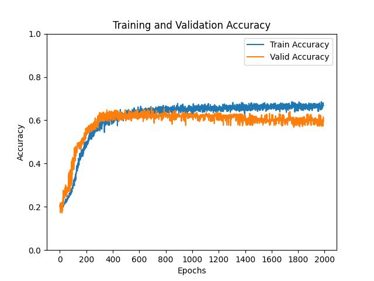

# Understanding the Effects of Different Reliabilities of Automated Vehicle Functionality on the Calibration of Trust

This repository contains the full analysis pipeline for studying how the mean Intersection over Union (mIoU) of AV perception outputs relates to human trust calibration. The code covers feature-importance analysis with multiple ML models, symbolic regression via PySR, and a multilayer perceptron (MLP) trust classifier trained on reliability, demographic, and contextual variables.

---

## Table of Contents

1. [Research Background](#research-background)
2. [System Requirements](#system-requirements)
3. [Installation](#installation)
4. [Project Structure](#project-structure)
5. [Data Schema](#data-schema)
6. [Running the Analyses](#running-the-analyses)
   - [Feature Importance (ML-approaches.py)](#1-feature-importance-ml-approachespy)
   - [Symbolic Regression — Basic (main_pysr_trust_calibration.py)](#2-symbolic-regression--basic)
   - [Symbolic Regression — Group-based (main_group_pysr_trust_calibration.py)](#3-symbolic-regression--group-based)
   - [Symbolic Regression — More Predictors (main_group_pysr_trust_calibration_more_predictors.py)](#4-symbolic-regression--more-predictors)
   - [Symbolic Regression — Personalized (main_personalized_pysr_trust_calibration.py)](#5-symbolic-regression--personalized)
   - [MLP Classifier — Training](#6-mlp-classifier--training)
   - [MLP Classifier — Evaluation](#7-mlp-classifier--evaluation)
   - [Running All PySR Pipelines at Once (Windows)](#8-running-all-pysr-pipelines-at-once-windows)
   - [Publication Figures](#9-publication-figures)
   - [Advanced Explainability](#10-advanced-explainability)
   - [Mixed-Effects Baseline](#11-mixed-effects-baseline)
7. [Configuration Reference](#configuration-reference)
8. [Output Artifacts](#output-artifacts)
9. [Running Tests](#running-tests)
10. [Troubleshooting](#troubleshooting)
11. [Results Summary](#results-summary)
12. [Tools and Libraries](#tools-and-libraries)
13. [Citation](#citation)

---

## Research Background

Autonomous vehicles (AVs) rely on perception systems to understand their environment. The **mIoU** (mean Intersection over Union) is a standard metric quantifying how accurately a perception model delineates objects — higher mIoU means more reliable perception. This project investigates:

- How much does mIoU drive human trust in AV systems?
- Do presentation style (boasting vs. ambiguous introduction) and driving scenario (highway, city, walking zone, cross-country) moderate this relationship?
- Can symbolic equations describe the mIoU–trust relationship at the individual and group level?
- How accurately can a deep model classify human trust levels from reliability and demographic features?

### Experimental design

The study uses a **mixed (split-plot) design**:

| Factor | Type | Levels |
|---|---|---|
| `mIoU` | **Within**-subjects | 20 values, all seen by every participant |
| `INTRODUCTION` | **Between**-subjects | 2 (`ambiguous`, `boasting`) |
| `SCENARIO` | **Between**-subjects | 4 (highway, city, walking zone, cross-country) |

Each participant is assigned to exactly **one** INTRODUCTION condition and **one** SCENARIO, and rates trust after each of 20 videos whose mIoU varies. That yields 8 between-subject cells of 14–18 participants each, and 20 repeated measures per participant.

This matters for the analysis: mIoU is the only factor that varies *within* a participant, so the repeated-measures structure applies to mIoU and its interactions, while the INTRODUCTION and SCENARIO main effects are estimated *between* participants. See [Mixed-Effects Baseline](#11-mixed-effects-baseline).

---

## System Requirements

| Requirement | Minimum |
|---|---|
| Python | 3.11+ |
| RAM | 8 GB (16 GB recommended for TabPFN) |
| Disk | ~2 GB for all dependencies |
| GPU | Optional; CUDA-enabled GPU speeds up MLP training and some models |
| OS | Windows, macOS, or Linux |

> **PySR dependency on Julia:** PySR uses Julia under the hood for symbolic regression. On the first run, PySR will automatically download and install a bundled Julia runtime — no manual Julia installation is needed.

---

## Installation

```bash
# 1. Create and activate a virtual environment
python -m venv .venv
# Windows:
.venv\Scripts\activate
# macOS/Linux:
source .venv/bin/activate

# 2. Upgrade pip and install all dependencies
pip install --upgrade pip
pip install --upgrade -r requirements.txt

# 3. Install development dependencies (needed to run tests)
pip install --upgrade -r requirements-dev.txt
```

> The first `import pysr` call will trigger Julia installation and precompilation. Expect a few minutes on the first run.

---

## Project Structure

```
.
├── data/                          # Preprocessed Excel datasets
│   ├── all_combined_prepared.xlsx
│   ├── all_combined_prepared_removed_REI.xlsx
│   ├── all_combined_prepared_with_demographics.xlsx
│   └── all_combined_prepared_with_demographics_with_baseline.xlsx
│
├── MLP/                           # Deep learning pipeline
│   ├── __init__.py
│   ├── dataset.py                 # PyTorch Dataset, label encoding, feature encoding
│   ├── network.py                 # 4-layer MLP architecture
│   ├── train.py                   # Training loop with checkpoint management
│   ├── eval.py                    # Checkpoint evaluation and confusion matrix
│   └── epochs/                    # Training curve snapshots (generated)
│
├── results/                       # All generated figures and text outputs
│   ├── ML-Approaches/
│   ├── PySR/
│   │   ├── split_groups/
│   │   ├── split_groups_personalized/
│   │   ├── more_predictors/
│   │   └── personalized_plots/
│   └── MLP/
│
├── tests/                         # Automated test suite
│   ├── test_data_integrity.py
│   ├── test_ml_approaches.py
│   ├── test_mlp_encoding.py
│   ├── test_mlp_label_modes.py
│   ├── test_pysr_helpers.py
│   └── test_repo_assets.py
│
├── ML-approaches.py               # ML baselines and feature-importance workflows
├── main_pysr_trust_calibration.py                          # PySR: per intro/scenario subset
├── main_group_pysr_trust_calibration.py                    # PySR: equal-group splitting
├── main_group_pysr_trust_calibration_more_predictors.py    # PySR: multi-feature model
├── main_personalized_pysr_trust_calibration.py             # PySR: per-participant
├── pysr_config.py                 # Shared PySR search config used by all four scripts
├── all_pysr.bat                   # Windows batch script to run all PySR pipelines
├── requirements.txt
└── requirements-dev.txt
```

---

## Data Schema

All datasets are Excel files with `Sheet1`. Columns vary by file:

### Core columns (all files)

| Column | Type | Description |
|---|---|---|
| `ProlificID` | string / int | Participant identifier — see the note below |
| `mIoU` | float, **0–100 scale** | Perception reliability for the shown video. Observed range `[67.87, 86.20]` across 20 distinct values |
| `trust` | float {1.0, 1.5, …, 5.0} | Aggregated trust rating on a 1–5 scale (half-steps possible). Mean ≈ 4.02, i.e. strongly ceiling-skewed |
| `Trust1`–`Trust5` | float | Individual trust sub-scale items |
| `SCENARIO` | string | Driving scenario — **label set differs by file**, see below |
| `INTRODUCTION` | string | System intro style: `ambiguous` (spelled `ambigious` in the baseline file) or `boasting` |

> **mIoU is a percentage, not a fraction.** Values run 67.87–86.20. Anything that rescales, centers, or feeds mIoU into an exponential/power operator has to account for this — see [Configuration Reference](#configuration-reference).

#### SCENARIO label sets

The two label sets refer to the same four scenarios. Code that filters on scenario names must match the file it is reading.

| Scenario | `all_combined_prepared*.xlsx` | `*_with_demographics*.xlsx` |
|---|---|---|
| Highway (3-lane) | `Highway` | `3Spurig` |
| City | `City` | `NeueMitte` |
| Walking zone | `Walking Zone` | `Spielstrasse` |
| Cross-country | `Cross-country` | `Ueberland` |

#### Participant identifiers

| File | `ProlificID` contents |
|---|---|
| `all_combined_prepared.xlsx` | Real Prolific IDs — 130 participants |
| `all_combined_prepared_removed_REI.xlsx` | Real Prolific IDs — 130 participants |
| `all_combined_prepared_with_demographics.xlsx` | **Constant `1`** — no participant structure |
| `all_combined_prepared_with_demographics_with_baseline.xlsx` | Real Prolific IDs — 134 participants |

Any analysis that groups or splits by participant must use one of the three files with real IDs. `all_combined_prepared_with_demographics.xlsx` cannot support a grouped split or a per-participant partition.

### Additional columns (demographics files)

| Column | Type | Description |
|---|---|---|
| `Age` | int | Participant age in years |
| `Gender` | string `A1`–`A4` | F / M / non-binary / prefer not to say (only `A1`–`A3` observed) |
| `Education` | string `A1`–`A5` | Secondary / Middle / High School / College / Vocational (only `A3`–`A5` observed) |
| `Job` | string `A1`–`A6` | Student (school) / Student (college) / Employee / Self-employed / Jobseeker / Other (`A1` not observed) |
| `License` | **int** | **Years** the participant has held a driving licence (range 1–42). Correlates r ≈ 0.92 with `Age` |
| `DrivingFrequency` | string `A1`–`A6` | Daily → less than once/month |
| `Distance` | string `A1`–`A5` | Annual kilometres driven (bands) |

> `License` is a count of years, not a `Y`/`N` flag. It belongs in the numeric feature block; passing it through an ordinal/label encoder replaces years with ranks and destroys the scale.

### Dataset variants

| File | Notes |
|---|---|
| `all_combined_prepared.xlsx` | Base dataset — 2600 rows, 130 participants |
| `all_combined_prepared_removed_REI.xlsx` | REI (Rational–Experiential Inventory) participants removed — 2310 rows |
| `all_combined_prepared_with_demographics.xlsx` | Base + demographics, 2656 rows. **`ProlificID` is a constant** — do not use for grouped analyses |
| `all_combined_prepared_with_demographics_with_baseline.xlsx` | Demographics + baseline trust, 2788 rows, 134 participants. The only file with both demographics and real IDs, so all grouped analyses use it |

---

## Running the Analyses

### 1. Feature Importance (ML-approaches.py)

Trains five regression models (Random Forest, CatBoost, XGBoost, LightGBM, TabPFN) on the demographics dataset and reports per-feature importance with uncertainty estimates.

```bash
python ML-approaches.py
```

**What it does:**
- Random Forest: MDI importance + permutation importance + SHAP bar chart
- CatBoost: native importance with bootstrap standard-deviation error bars
- XGBoost: native importance with per-tree std; saves model to `your_model.json`
- LightGBM: native importance with per-tree std; SHAP beeswarm plot
- TabPFN: zero-shot pre-trained regressor; reports point and quantile predictions

GPU models (CatBoost, XGBoost, LightGBM, TabPFN) fall back to CPU automatically if no compatible GPU is found.

**Outputs** → `results/ML-Approaches/`

```
feature_importance_random_classifier.png
perm_importances_random_regressor.png
enhanced_shap_summary_plot.png
feature_importance_catboost.png
feature_importance_catboost_shap.png
feature_importance_xgboost.png
feature_importance_xgboost_shap.png
feature_importance_lightgbm.png
enhanced_shap_summary_plot_lgboost.png
results_tabpfnregressor.txt
model_metrics.json
fact-av.tabpfn_fit
```


---

### 2. Symbolic Regression — Basic

Runs PySR on each (INTRODUCTION, SCENARIO) combination for both the base and REI-filtered datasets to derive explicit mathematical equations relating mIoU to trust.

```bash
python main_pysr_trust_calibration.py
```

**Outputs** → `results/PySR/`

For each combination and dataset:
- `model_info_<intro>_<scenario>_<dataset>.txt` — SymPy expression + LaTeX table
- `relationship_pysr_<intro>_<scenario>_<dataset>.png` — scatter + fitted curve

Plus one pooled fit per dataset:
- `model_info_all_data_<dataset>.txt` — SymPy expression + LaTeX table
- `relationship_pysr_all_data_<dataset>.png` — scatter + fitted curve

> The pooled fit previously wrote only the figure; its equation was computed and discarded.

---

### 3. Symbolic Regression — Group-based

Partitions data by participant (ProlificID) × INTRODUCTION × SCENARIO into **equal-trust groups** (≥14 identical trust ratings, or 2 groups of ≥7) and **other rows**, then fits separate PySR models for each partition. Also fits a per-participant personalized model within the group split.

```bash
python main_group_pysr_trust_calibration.py
```

> **Caveat.** This partition conditions on the *outcome's own variance* — participants who used the trust scale flatly go to the equal-trust group (87 of 130 in the base dataset), the rest to `other_rows_df` (43). Slopes estimated on either side are not unbiased estimates of the mIoU effect, so treat this split as exploratory rather than confirmatory.

**Outputs** → `results/PySR/split_groups/` and `results/PySR/split_groups_personalized/`

Per dataset, in `split_groups/`:

| File | Content |
|---|---|
| `model_info_other_rows_df_<dataset>.txt` | Equation for the high-variance subset |
| `relationship_pysr_other_rows_df_<dataset>.png` | Scatter + curve, with condition legend |
| `relationship_pysr_other_rows_df_stacked_<dataset>.png` | Same fit, legend suppressed |
| `model_info_all_equal_df_<dataset>.txt` | Equation for the equal-trust subset |
| `relationship_pysr_all_equal_df_<dataset>.png` | Scatter + curve |

Per participant, in `split_groups_personalized/`: `model_info_<ProlificID>_<dataset>.txt` and `relationship_pysr_<ProlificID>_<dataset>.png`.

> The two `other_rows_df` figures come from a **single** search. This step previously ran two byte-identical searches of the same data under different filenames, so the resulting equation files could disagree purely because the search is stochastic. The personalized fits now also run for *both* datasets — they previously read a leaked loop variable and silently covered only the last one.

---

### 4. Symbolic Regression — More Predictors

Extends the group-based analysis with a full demographic feature matrix (mIoU, Age, one-hot categoricals, label-encoded ordinals) for the unbalanced participant groups.

```bash
python main_group_pysr_trust_calibration_more_predictors.py
```

> This script reads `all_combined_prepared_with_demographics_with_baseline.xlsx`. It previously read `all_combined_prepared_with_demographics.xlsx`, whose `ProlificID` is a constant — so every cell qualified as an "equal group", `other_rows_df` came out empty, and the script returned at its `len(df) < 3` guard without writing anything. It now also raises if the input has fewer than two distinct participants.

**Outputs** → `results/PySR/more_predictors/`

---

### 5. Symbolic Regression — Personalized

Fits an independent PySR model for each participant across both datasets.

```bash
python main_personalized_pysr_trust_calibration.py
```

> **Caveat.** Each participant contributes exactly 20 rows at 20 distinct mIoU values — one observation per x. Fitting a free-form expression of up to `maxsize=10` nodes from an 18-operator alphabet to 20 points will fit noise; the committed equations include artifacts such as `4.966721 - tan(cos(tan(x0/0.37383464))**6)`. For per-participant slopes, a random-slope mixed-effects model is the better-conditioned tool.

**Outputs** → `results/PySR/personalized_plots/`

- `model_info_<ProlificID>_<dataset>.txt` — SymPy expression + LaTeX table
- `relationship_pysr_<ProlificID>_<dataset>.png` — scatter + fitted curve

> The `.txt` filename now carries the dataset stem, as the `.png` already did. Without it the second dataset's equations overwrote the first's, leaving the two artifacts describing different fits.

---

### 6. MLP Classifier — Training

Trains a 4-layer MLP (`34 → 128 → 512 → 1024 → 1024 → num_classes`) on the demographics dataset. The best checkpoint (by validation F1) is saved and then evaluated once on the held-out test split.

```bash
# Default: 5-class floor-based trust labels (3.5 → class 3, etc.)
python MLP/train.py

# Alternative: 9 classes — one per observed half-step (1.0, 1.5, …, 5.0)
python MLP/train.py --trust-label-mode separate_fractional
```

**Arguments**

| Argument | Values | Default | Description |
|---|---|---|---|
| `--trust-label-mode` | `floor`, `separate_fractional` | `floor` | How fractional trust ratings are mapped to class indices |

**Label modes explained:**

- **`floor`** — floors each trust value to the nearest integer: 1.5 → class 0, 2.5 → class 1, 3.0 → class 2, 4.5 → class 3. Always produces 5 classes.
- **`separate_fractional`** — each observed trust value (1.0, 1.5, 2.0, …, 5.0) gets its own class. Typically produces 9 classes.

**Training configuration** (edit `MLP/train.py` to change):

| Parameter | Default |
|---|---|
| Epochs | 2000 |
| Batch size | 256 |
| Learning rate | 1e-4 |
| Optimizer | AdamW |
| Loss | CrossEntropyLoss (inverse-frequency class weights) |
| Data split | 80 / 10 / 10 — **grouped by `ProlificID`**, so no participant spans two splits |
| Split seed | 1337 |
| Checkpoint criterion | Best validation macro-F1 |

**Outputs** → `results/MLP/` and `MLP/epochs/`

```
best_valid_floor.pt                  # Model checkpoint
best_valid_floor.json                # Validation and test metrics
train.labels.pdf / .jpg              # Label distribution histogram
valid.labels.pdf / .jpg
test.labels.pdf / .jpg
epochs/epoch10.jpg, epoch20.jpg …    # Training curve snapshots
```



---

### 7. MLP Classifier — Evaluation

Loads a saved checkpoint, runs inference on the test split, and produces a normalised confusion matrix.

```bash
# Evaluate the default floor-mode checkpoint
python MLP/eval.py

# Evaluate the separate_fractional checkpoint
python MLP/eval.py --trust-label-mode separate_fractional

# Point to a specific checkpoint file
python MLP/eval.py --checkpoint-path path/to/checkpoint.pt
```

**Arguments**

| Argument | Default | Description |
|---|---|---|
| `--trust-label-mode` | `floor` | Must match the mode used during training |
| `--checkpoint-path` | auto-resolved from mode | Explicit path to a `.pt` checkpoint |

**Outputs** → `results/MLP/`

```
confusion_matrix.pdf / .png             # floor mode, annotated with QWK + MAE + F1
confusion_matrix_separate_fractional.pdf / .png
calibration.pdf / .png                  # reliability diagram + confidence histogram (ECE)
calibration_separate_fractional.pdf / .png
per_class_metrics.csv                   # per-class precision / recall / F1 / support
per_class_metrics_separate_fractional.csv
```

In addition to accuracy and macro-F1, the evaluator reports:

- **Quadratic-Weighted Kappa (QWK)** — ordinal-aware agreement; rewards predictions that are close to the true class even if not exact. Standard for ordinal targets like Likert ratings.
- **MAE in trust units** — average distance between the predicted and true trust value on the original 1–5 scale.
- **Expected Calibration Error (ECE)** — average gap between predicted confidence and empirical accuracy, summarising the reliability diagram as a scalar. Lower is better.

---

### 8. Running All PySR Pipelines at Once (Windows)

```bat
all_pysr.bat
```

This batch script sequentially executes all four PySR scripts. PySR is compute-intensive; on a typical workstation expect each script to run for 30–90 minutes depending on dataset size and `niterations`.

---

### 9. Publication Figures

Generates four reviewer-grade figures consolidating model behaviour. All figures use a colorblind-safe Okabe-Ito palette and standardised typography defined in `plotting_style.py`.

```bash
python publication_figures.py
```

**What it produces** → `results/publication/`

| File | Content |
|---|---|
| `forest_feature_importance.{pdf,png}` | Cross-model normalized feature importance comparison (one row per feature, one marker per model) |
| `importance_rank_heatmap.{pdf,png}` | Companion heatmap showing per-feature rank stability across RF, XGBoost, LightGBM, CatBoost |
| `miou_trust_panel.{pdf,png}` | 2×2 panel of mIoU → trust curves (one scenario per panel, ambiguous vs boasting overlaid) with bootstrap 95% bands |
| `pdp_ice_miou_by_cell.{pdf,png}` | Partial dependence + ICE for mIoU across the 8 (INTRODUCTION × SCENARIO) cells |
| `model_importances_raw.csv` | Tidy importance values used as input to the forest plot |

All models use a participant-grouped train/test split (`GroupShuffleSplit` on `ProlificID`) to prevent leakage across the splits.

---

### 10. Advanced Explainability

Extends the existing SHAP bar/beeswarm plots with three new outputs aimed directly at the moderation hypotheses (does mIoU × INTRODUCTION or mIoU × SCENARIO matter?).

```bash
python explainability_extras.py
```

**What it produces** → `results/publication/explainability/`

| File | Content |
|---|---|
| `shap_interaction_heatmap.{pdf,png}` | Mean absolute pairwise SHAP interaction strength across all features |
| `shap_top_interactions.csv` | Ranked table of the 15 strongest feature×feature interactions |
| `shap_miou_moderation.{pdf,png}` | SHAP(mIoU) coloured by INTRODUCTION (panel A) and SCENARIO (panel B) — directly visualises moderation |
| `dice_counterfactuals.csv` | DiCE-generated minimal feature changes that would flip a low-trust prediction to high-trust |
| `dice_feature_change_frequency.{pdf,png}` | How often each feature is suggested for change across counterfactual examples |
| `anchors_rules.txt` | Local high-precision IF–THEN rules. Uses `alibi.AnchorTabular` when available; otherwise falls back to a shallow surrogate decision tree |

> `alibi` does not build cleanly on every Windows install; the script transparently uses the surrogate-tree fallback when import fails.

---

### 11. Mixed-Effects Baseline

The study uses a within-subjects design — every participant rates trust across multiple mIoU values, two INTRODUCTION conditions and four SCENARIOs. Treating each row as i.i.d. (as the ML baselines do) violates the repeated-measures structure. This script fits a linear mixed-effects (LME) model with a random intercept per participant and tests the moderation hypotheses directly.

```bash
python mixed_effects_baseline.py
```

**Three nested models are fit and compared (likelihood-ratio + AIC + BIC):**

| Model | Fixed effects |
|---|---|
| `M0` | (intercept only — null variance decomposition) |
| `M1` | mIoU, INTRODUCTION, SCENARIO |
| `M2` | M1 + mIoU × INTRODUCTION + mIoU × SCENARIO interactions |

**What it produces** → `results/publication/mixed_effects/`

| File | Content |
|---|---|
| `summary_M0.txt` / `summary_M1.txt` / `summary_M2.txt` | Full statsmodels textual summaries |
| `model_comparison.csv` | AIC, BIC, log-likelihood, LR test for nested model comparison |
| `fixed_effects_M2.csv` | Tidy coefficient table with 95% CIs and p-values |
| `icc.json` | Intraclass correlation + between-vs-within-participant variance decomposition |
| `fixed_effects_forest.{pdf,png}` | Coefficient forest plot for M2 with 95% CIs (significant effects highlighted) |
| `interaction_marginal_effects.{pdf,png}` | Predicted-trust curves over mIoU per (INTRODUCTION × SCENARIO) cell from M2 |
| `summary_M2_random_slope.txt` | M2 refitted with a random slope for mIoU (sensitivity check) |
| `fixed_effects_M2_random_slope.csv` | Side-by-side mIoU-term estimates, SEs and p-values: random intercept vs random slope |
| `random_slope_sensitivity.json` | Log-likelihoods, convergence status, and the mIoU SD used for rescaling |

#### Random-slope sensitivity check

M0–M2 specify a **random intercept only**, which assumes every participant shares one mIoU slope. Since mIoU is the *within*-subject factor (INTRODUCTION and SCENARIO vary only between participants), that assumption is what the moderation p-values rest on. `fit_random_slope_sensitivity()` refits M2 with `re_formula="~mIoU_sd"` and reports both side by side.

| mIoU term | Random intercept | + Random slope |
|---|---|---|
| `mIoU` | p = 0.071 | p = 0.301 |
| `mIoU × INTRODUCTION[boasting]` | p = 0.197 | p = 0.466 |
| **`mIoU × SCENARIO[NeueMitte]`** | **p = 0.0013** | **p = 0.069** |
| `mIoU × SCENARIO[Spielstrasse]` | p = 0.936 | p = 0.981 |
| `mIoU × SCENARIO[Ueberland]` | p = 0.254 | p = 0.521 |

The **point estimates are essentially unchanged** (0.0964 → 0.0961 for the City interaction); only the standard errors move, uniformly by ~1.76×. That is the expected signature of a random-effects correction on a balanced within-subject design: the effect size was fine, the uncertainty was understated. Adding the random slope improves the log-likelihood substantially (−2369.2 → −2293.7), so the data clearly support participant-specific mIoU slopes.

**Consequence:** the mIoU × City moderation does not reach p < 0.05 under the better-specified model. Which model to report is a call for the authors; both are written out, and M2 and all published figures are left untouched.

> **Predictor scale matters here.** mIoU is on a 0–100 scale, so `mIoU_c` spans about [−8.8, +9.6]. Against a random-intercept variance near 1.4, a random slope on that scale does not converge — statsmodels exhausts lbfgs and cg, reports a non-positive-definite Hessian, and returns SEs inflated by a uniform ~13× across *every* coefficient, which is an artifact rather than a correction. The sensitivity check therefore expresses mIoU in standard-deviation units (1 unit = 5.554 mIoU points). That is a pure reparameterisation of the fixed effects — the random-intercept p-values are identical either way — and it converges with no warnings. `random_slope_sensitivity.json` records `random_slope_trustworthy` so a non-converged fit cannot be mistaken for a result.

> The script uses `data/all_combined_prepared_with_demographics_with_baseline.xlsx` because it is the only file that retains real ProlificIDs (134 participants).

---

## Configuration Reference

### ML-approaches.py (`Config` dataclass)

Edit the `Config` class at the top of `ML-approaches.py`:

```python
@dataclass
class Config:
    data_path: Path = Path("data") / "all_combined_prepared_with_demographics_with_baseline.xlsx"
    results_path: Path = Path("results") / "ML-Approaches"
    sheet_name: str = "Sheet1"
    test_size: float = 0.2          # Fraction of *participants* held out for testing
    random_state: int = 42
    bootstrap_n: int = 10           # CatBoost error-bar resamples
    target_column: str = "trust"
    group_column: str = "ProlificID"  # Split unit — keeps participants out of both splits
```

### PySR scripts (`pysr_config.py`)

All four PySR scripts share one search configuration in `pysr_config.py`, which exposes `create_model()` and `write_model_info()`. Tune these parameters to control search quality vs. runtime:

| Parameter | Default | Effect |
|---|---|---|
| `niterations` | 300 (basic script) / 500 (others) | More iterations = longer search, potentially better equations |
| `maxsize` | 10 | Maximum expression complexity (nodes in the expression tree) |
| `ncycles_per_iteration` | 2500 | Evolutionary cycles per iteration |
| `precision` | 32 | Float precision (`16`, `32`, or `64`) |
| `turbo` | `True` | Enable Julia LoopVectorization for faster evaluation |
| `batching` | `False` | Pinned explicitly — see the PySR 2.0 note below |
| `random_state` | `None` | Search seed. Leave `None` for exploration |
| `deterministic` | `False` | Repeatable search. Requires serial execution, so much slower |

**Reproducing a specific run.** PySR's search is stochastic, so by default two runs on the same data can return different equations. For a repeatable publication run:

```python
model = create_model(niterations=500, random_state=1337, deterministic=True)
```

`deterministic=True` forces `parallelism="serial"`, which is considerably slower — use it for a final run, not for exploration.

**PySR 2.0 compatibility.** Every keyword in `pysr_config.py` is accepted by both `pysr 1.5.10` and `pysr 2.0.0-alpha.11`, so no change is needed when 2.0 ships. Two defaults move between those versions:

| Parameter | 1.5.10 | 2.0.0-alpha |
|---|---|---|
| `batching` | `False` | `"auto"` (enables minibatching when `len(X) > 1000`) |
| `batch_size` | `50` | `None` (auto-selects 128 for `N < 5000`) |

`batching` is therefore pinned to `False` in `create_model()`. Left at the 2.0 default it would silently switch the fits on 2600/2310 rows (`run_all_data`) and on `all_equal_df` (1740 rows) from full-sample MSE to a 128-row minibatch MSE, changing which equations the search finds. `tests/test_pysr_api_compat.py` guards this and the rest of the API surface — run `pytest tests/test_pysr_api_compat.py` after any PySR upgrade.

> `ncyclesperiteration` (no underscores) still works but is deprecated and emits a `FutureWarning`. Use `ncycles_per_iteration`. The PySR scripts no longer call `warnings.filterwarnings("ignore")` at import, so warnings like this are now visible.

### MLP hyperparameters

Adjust constants at the top of `MLP/train.py`:

```python
epochs = 2000
batch_size = 16
learning_rate = 1e-4
```

---

## Output Artifacts

| Path | Produced by | Description |
|---|---|---|
| `results/ML-Approaches/feature_importance_*.png` | `ML-approaches.py` | Feature importance bar charts |
| `results/ML-Approaches/model_metrics.json` | `ML-approaches.py` | MAE / MSE / RMSE / R² for all models |
| `results/ML-Approaches/your_model.json` | `ML-approaches.py` | Serialised XGBoost model |
| `results/PySR/**/*.txt` | PySR scripts | Discovered equations (SymPy + LaTeX) |
| `results/PySR/**/*.png` | PySR scripts | Scatter + fitted-curve visualisations |
| `results/MLP/best_valid_*.pt` | `MLP/train.py` | Best model checkpoint |
| `results/MLP/best_valid_*.json` | `MLP/train.py` | Training report with metrics |
| `results/MLP/confusion_matrix*.pdf/.jpg` | `MLP/eval.py` | Normalised confusion matrix |
| `MLP/epochs/epoch*.jpg` | `MLP/train.py` | Training accuracy curve snapshots |

---

## Running Tests

Install development dependencies if you have not already:

```bash
pip install -r requirements-dev.txt
```

Run the full suite:

```bash
pytest
```

Run a specific file or test:

```bash
pytest tests/test_mlp_encoding.py
pytest tests/test_ml_approaches.py::TestConfig::test_default_target_column
```

### Test suite overview

| File | What it covers |
|---|---|
| `test_data_integrity.py` | Data files exist and contain required columns |
| `test_ml_approaches.py` | `Config`, `DataProcessor`, `prepare_categorical_as_string`, `get_tabpfn_quantile_columns` |
| `test_mlp_encoding.py` | All encoding functions (`encode_scenario`, `encode_intro`, `encode_trust_value`, etc.) |
| `test_mlp_label_modes.py` | `floor` and `separate_fractional` label-mapping logic |
| `test_pysr_helpers.py` | `find_equal_groups`, `split_groups`, `build_feature_matrix` |
| `test_pysr_api_compat.py` | The PySR API surface `pysr_config.py` depends on — kwargs, defaults, export methods, custom-operator contract. Run this after any PySR upgrade |
| `test_repo_assets.py` | Existence of generated result files and source scripts |

> Tests that check generated assets (`test_readme_assets_exist`, `test_model_json_is_valid`) are skipped automatically if the analysis scripts have not been run yet.

---

## Troubleshooting

### PySR / Julia installation fails

PySR downloads a Julia runtime on first use via `juliacall`. If this fails due to network restrictions, set `JULIA_DEPOT_PATH` to point at an existing Julia installation.

> The old `pysr.install()` entry point has been removed — calling it only emits a `FutureWarning`. Julia is now initialised automatically at import time.

PySR 2.0 additionally resolves SymbolicRegression.jl from a **git URL at a pinned revision** rather than from the Julia registry, so the first import needs `git` on `PATH` plus network access.

### CUDA / GPU not detected

The scripts detect GPU availability via `torch.cuda.is_available()`. All GPU-accelerated models fall back to CPU automatically. To force CPU explicitly, unset `CUDA_VISIBLE_DEVICES`:

```bash
# Linux / macOS
CUDA_VISIBLE_DEVICES="" python ML-approaches.py

# Windows PowerShell
$env:CUDA_VISIBLE_DEVICES=""; python ML-approaches.py
```

### `ModuleNotFoundError: No module named 'torch'`

PyTorch is listed in `requirements.txt`. Install it:

```bash
pip install torch>=2.0.0
```

For GPU support with a specific CUDA version see [https://pytorch.org/get-started/locally/](https://pytorch.org/get-started/locally/).

### MLP evaluation fails with class count mismatch

The checkpoint stores the number of classes used during training. If you try to evaluate with a different `--trust-label-mode` than was used for training, you will see:

```
ValueError: Checkpoint expects N classes but dataset mode '...' resolves to M classes.
```

Pass `--trust-label-mode` to `eval.py` matching the mode that was used in `train.py`, or provide `--checkpoint-path` pointing to the right file.

### Data file not found

Scripts expect data files relative to the working directory. Run all scripts from the repository root:

```bash
# Always run from the repo root, not from inside MLP/ or results/
cd /path/to/FACT-AV
python ML-approaches.py
python MLP/train.py
```

---

## Results Summary

| Analysis | Key Finding |
|---|---|
| **Feature Importance** | No model beats a mean baseline by a useful margin on held-out participants. Held-out R²: TabPFN 0.16, CatBoost 0.03, XGBoost −0.02, LightGBM −0.02, Random Forest −0.06 (`results/ML-Approaches/model_metrics.json`). Because four of five models do not beat the test-set mean, their impurity-based importance rankings are not interpretable as effect sizes, and no percentage is quoted from them |
| **Symbolic Regression** | Weak overall relationship: OLS mIoU→trust R² = 0.0075 on the full base dataset. Within the post-hoc split, the *high-variance* subset (`other_rows_df`, 43 participants) shows R² = 0.043 while the equal-trust subset (87 participants) shows R² = 0.0008. Note this split conditions on the outcome's own variance, so it is exploratory only |
| **MLP Classifier** | 34.4% test accuracy, 0.223 macro-F1 on the 5-class task, best epoch 11 of 2000 (`results/MLP/best_valid_floor.json`). That is below the majority-class share of the test split (≈41%), so the classifier does not currently beat a constant predictor |
| **Mixed-Effects Baseline** | ICC=0.69 — about 69% of variance in trust ratings is between participants rather than within. M2 (with mIoU × SCENARIO interactions) fits significantly better than the main-effects model (LR p≈0.006). Under M2's random-intercept structure the mIoU × `NeueMitte` (City) interaction is the strongest moderator (p≈0.001, surviving Bonferroni across the four interaction terms) and the mIoU main effect is not significant (p≈0.071). **However**, refitting with a random slope for mIoU — the maximal structure this design supports — leaves the estimate unchanged but widens its SE by ~1.76×, moving the City interaction to **p≈0.069**. The random-slope model fits markedly better (log-lik −2369.2 → −2293.7), so the moderation result should be treated as suggestive rather than established. See [Random-slope sensitivity check](#random-slope-sensitivity-check). |
| **SHAP moderation analysis** | The mIoU slope visibly differs between scenarios and intro conditions, consistent with the LME interaction tests. The strongest pairwise interaction involves Age and License years, but note those two correlate at r ≈ 0.92, so that pair should not be read as two independent moderators. |

### Qualitative Feedback Highlights

> "The more videos I watched, the more I felt comfortable with the system."

> "Some of the videos had distracting artifacts which impacted my trust level."

---

## Tools and Libraries

| Category | Library |
|---|---|
| Data processing | `pandas`, `numpy`, `openpyxl` |
| Visualisation | `matplotlib`, `seaborn` |
| Classical ML | `scikit-learn` |
| Gradient boosting | `xgboost`, `lightgbm`, `catboost` |
| Foundational model | `tabpfn` |
| Symbolic regression | `pysr` |
| Explainability | `shap` |
| Deep learning | `torch`, `torchmetrics`, `tqdm` |
| Testing | `pytest` |

---

## Citation

If you use this repository in academic work, please cite the associated publication or dataset (add citation details as appropriate).
